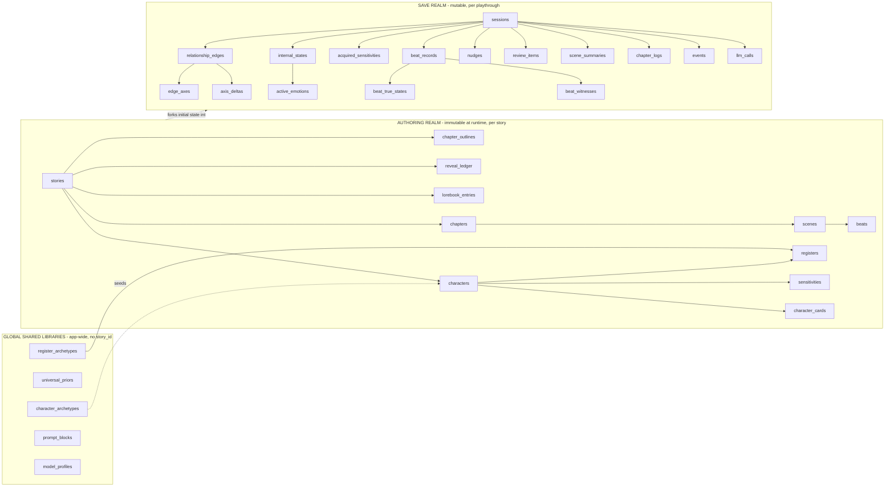

# Database — Persistence schema

> **Status: Proposed (planning)** — column-level living detail of [ADR 0012](../adr/0012-persistence-schema.md), extended with the schema for [ADR 0013–0016](../adr/README.md). This is the **buildable** schema — every table with its columns and types. ADR 0012 is the strategy of record; this doc is the living detail and is **edited in place** as the design evolves (migrations are generated from it when we build). · **Last Updated:** 2026-06-04

> **Engine:** MySQL 8 / MariaDB 11.7 (wire-compatible; Laravel 13 `mariadb` driver). InnoDB, `utf8mb4`. JSON columns supported on both.
>
> **Conventions.** Every table has `id` `BIGINT UNSIGNED` PK (auto-increment) unless noted. FKs are `<name>_id` `BIGINT UNSIGNED`. `created_at` / `updated_at` are `TIMESTAMP` (Laravel `timestamps()`). **Append-only** tables carry `created_at` only and are never `UPDATE`/`DELETE`d. Enums are stored as DB `ENUM`/`VARCHAR` and mirrored by a PHP enum. Money (none yet) would be integer Rupiah; times are UTC in DB, rendered Asia/Jakarta.

> **Build status (Sprint 3, 2026-06-05).** The engine is realized in config: default connection `mariadb` (`config/database.php`), dev DB `novel_engine`, test DB `novel_engine_test`; migrations are reversible (up/down verified). **Foundation** tables migrated in Sprint 1 — `users`, `password_reset_tokens`, `sessions`, two-factor columns, `passkeys`, `cache`, `jobs`. **Authoring realm** migrated in Sprint 3 (S-4.1.1): `stories` (now **owner-scoped** — carries `user_id`, deviating from §3.1 below), `chapters`, `characters`, `scenes`, `beats`, `character_cards`, `reveal_ledger`, `lorebook_entries`, `registers`, `sensitivities`, `chapter_outlines` — each with its PHP enum + Eloquent model + factory. **Deferred FK constraints** (columns present, nullable, no constraint yet): `character_cards.review_item_id`, `chapter_outlines.review_item_id` (→ save-realm `review_items`), `registers.archetype_id` (→ global `register_archetypes`) — see PH-16. The **save realm** and **global libraries** land in **Sprint 4** (E4.2 / E4.1.2).

---

## 1. Core idea — two realms

Mirror the ADR line between **authored template data** (immutable at runtime, ADR 0001) and **evolving runtime state** (mutable, written at scene/session boundaries, ADR 0002). A `session` (a save) is a **fork** of the template into evolving state — multi-save and reset for free. The fork **deep-copies** the authored starting state (seeds edges from `disposition_priors`, ADR 0002/0013) into the save realm at creation.

Full ERD: [Diagrams/Data/Persistence_Erd.md](./Diagrams/Data/Persistence_Erd.md). The **source bibles** (`luna-archi.md`, …) stay as repo markdown referenced by `characters.bible_path` — **never injected** (ADR 0001).

---

## 2. Normalize-vs-JSON strategy

**Normalize what the engine reads/writes per-axis or queries on; JSON for nested authorial config read as a whole.**

- **Rows (normalized):** `edge_axes` (delta engine + decay are per-axis), `axis_deltas` (append-only log), `beat_true_states` / `beat_witnesses` (isolation), `active_emotions` (per-emotion own clock).
- **JSON columns:** `knowledge_boundary`, `disposition_priors`, register `dimensions` + `overrides`, `topic_flags`, sensitivity `detect`/`axes`, nudge `kind`, the `scar` sub-object, `masks`, `resume_anchor` — read as a unit (+ a generated column if one ever needs indexing).
- **Materialized state + log:** `edge_axes`/`internal_states` hold fast current values; `axis_deltas` is the history. Not event-sourcing.

---

## 3. Authoring realm (template — immutable at runtime)

### 3.1 `stories`

| Column | Type | Notes |
|--------|------|-------|
| `user_id` | FK → `users` | **owner** (ADR 0012); adopts `BelongsToOwner` + `StoryPolicy`. **Built in Sprint 3** (S-4.1.1) ahead of the original Phase-2 plan — children inherit isolation transitively (see PH-16) |
| `slug` | `VARCHAR(120)` | unique |
| `title` | `VARCHAR(200)` | |
| `description` | `TEXT NULL` | |
| `settings` | `JSON NULL` | per-story config (default POV, model tiers, tunable rubric overrides) |

### 3.2 `characters`

| Column | Type | Notes |
|--------|------|-------|
| `story_id` | FK → `stories` | |
| `slug` | `VARCHAR(120)` | unique per story |
| `name` | `VARCHAR(150)` | |
| `bible_path` | `VARCHAR(255) NULL` | repo markdown path; **never injected** (ADR 0001) |
| `base_opacity` | `TINYINT UNSIGNED` | 0–100; seeds register `composure` / legibility (ADR 0010) |
| `live_axes` | `JSON` | declared live axes, e.g. `["affection","trust","fear","romantic"]` (ADR 0002) |
| `model_tier` | `ENUM('major','minor')` | major = full card/Sonnet, minor = compressed/Haiku (ADR 0007) |
| `is_player` | `BOOLEAN` default `false` | player = appearance-only, no outgoing edges (ADR 0001) |

Unique `(story_id, slug)`.

### 3.3 `character_cards` — per-chapter compiled snapshot (ADR 0001/0013)

| Column | Type | Notes |
|--------|------|-------|
| `character_id` | FK → `characters` | |
| `chapter_id` | FK → `chapters` | the chapter this snapshot is valid for |
| `folded_identity` | `LONGTEXT` | compiled spoiler-free identity prose (the `[IDENTITY]` block, ADR 0007) |
| `knowledge_boundary` | `JSON` | `{ knows:[…], does_not_know:[…] }`, clamped to chapter (ADR 0001/0013) |
| `disposition_priors` | `JSON` | edge-seed priors keyed by target traits (gender, demeanor, faction, shows-interest) (ADR 0002) |
| `voice` | `JSON` | speech-pattern subset (ADR 0006 `speech`) |
| `tells` | `JSON` | authored leaks (ADR 0006/0010) |
| `appearance` | `TEXT NULL` | appearance card (the only card content for the player) |
| `compiled_source_hash` | `VARCHAR(64) NULL` | bible+ledger hash, to detect when a recompile is needed (ADR 0013 §4) |
| `review_item_id` | FK → `review_items` `NULL` | the `card_compile` review record (ADR 0013) |

Unique `(character_id, chapter_id)`. Immutable at runtime; recompiled per chapter (ADR 0013 §4).

### 3.4 `reveal_ledger` — load-bearing secrets → reveal point (ADR 0013 §3) **[new]**

| Column | Type | Notes |
|--------|------|-------|
| `story_id` | FK → `stories` | |
| `character_id` | FK → `characters` `NULL` | whom the secret is about (null = world secret) |
| `fact` | `VARCHAR(255)` | the secret, e.g. `the_diagnosis`, `the_cure`, `parents_died_searching` |
| `reveal_chapter_id` | FK → `chapters` | the chapter it becomes known |
| `who_knows` | `JSON` | character slugs who know it **before** the reveal, e.g. `["vixia-archi"]` |
| `notes` | `TEXT NULL` | author note |

Drives the compile clamp: a fact with `reveal_chapter > N` becomes an explicit `does_not_know` entry on a chapter-`N` card.

### 3.5 `register_archetypes` — shared grammar library (ADR 0006) · **global, no `story_id`**

| Column | Type | Notes |
|--------|------|-------|
| `slug` | `VARCHAR(120)` | unique; `one_way_mirror`, `romantic_deflection`, `unguarded`, `wary` |
| `name` | `VARCHAR(150)` | |
| `dimensions` | `JSON` | profile over the fixed canonical dimension set |
| `description` | `TEXT NULL` | |

### 3.6 `registers` — card instantiation or bespoke (ADR 0006)

| Column | Type | Notes |
|--------|------|-------|
| `character_id` | FK → `characters` | |
| `slug` | `VARCHAR(120)` | `koakuma_default`, `transparent_mess`, `boundary_protection` |
| `archetype_id` | FK → `register_archetypes` `NULL` | null = bespoke (e.g. `transparent_mess`) |
| `dimensions` | `JSON` | `{ disclosure, proximity, flow, deflection, sincerity, composure, reads_target }` |
| `speech_ref` | `VARCHAR(120) NULL` | which voice subset (`koakuma_voice`, `vixia_voice`) |
| `tells` | `JSON` | authored leaks for this register (`pink-ears`, `glove-adjust`) |
| `is_pinned` | `BOOLEAN` default `false` | hard-pin base, bypasses threshold selector (Luna→Vixia) (ADR 0006) |

Unique `(character_id, slug)`.

### 3.7 `sensitivities` — authored amplifiers/special-cases (ADR 0005)

| Column | Type | Notes |
|--------|------|-------|
| `character_id` | FK → `characters` | |
| `slug` | `VARCHAR(120)` | `threat_to_vixia`, `pitied_as_fragile` |
| `detect` | `TEXT` | natural-language matcher (LLM matches) |
| `target` | `ENUM('actor','beneficiary','witnessed_third_party')` | who the reaction is about (ADR 0005) |
| `axes` | `JSON` | `{ affection: "down", trust: "down" }` |
| `weight` | `ENUM('low','medium','high')` | salience multiplier; rubric config maps to a number |
| `channel` | `ENUM('drift_only','rupture_only','scales_with_severity')` | |

Unique `(character_id, slug)`.

### 3.8 `universal_priors` — shared appraisal baseline (ADR 0005) · **global, no `story_id`**

| Column | Type | Notes |
|--------|------|-------|
| `slug` | `VARCHAR(120)` | unique; `insult`, `kindness`, `threat`, `broken_promise` |
| `detect` | `TEXT` | |
| `axes` | `JSON` | |
| `default_weight` | `ENUM('low','medium','high')` | |
| `channel` | `ENUM('drift_only','rupture_only','scales_with_severity')` | |

### 3.9 `lorebook_entries` — keyword-injected world facts (ADR 0013 §5)

| Column | Type | Notes |
|--------|------|-------|
| `story_id` | FK → `stories` | |
| `title` | `VARCHAR(200) NULL` | |
| `keywords` | `JSON` | trigger terms, e.g. `["Crystal Hollow","gloves","Chrysalis"]` |
| `content` | `TEXT` | the world fact (world only — never a character's interiority) |
| `min_reveal_chapter_id` | FK → `chapters` `NULL` | optional: don't inject before this chapter |

Injected into the Narrator and (knowledge-bounded) into NPC context on keyword match (ADR 0013/0016).

### 3.10 `chapters` (ADR 0015)

| Column | Type | Notes |
|--------|------|-------|
| `story_id` | FK → `stories` | |
| `number` | `INT` | |
| `title` | `VARCHAR(200)` | |
| `pov_default` | `VARCHAR(120)` | default POV contract (ADR 0009) |
| `outline` | `TEXT NULL` | pantser route outline |
| `word_cap` | `INT NULL` | outer hard pacing flag — forces a chapter wrap (ADR 0008/0015) |

Unique `(story_id, number)`.

### 3.11 `scenes` (ADR 0009/0015)

| Column | Type | Notes |
|--------|------|-------|
| `chapter_id` | FK → `chapters` | |
| `number` | `INT` | |
| `pov_mode` | `VARCHAR(60)` | `first` / `third_limited` / … (ADR 0009) |
| `pov_anchor` | `VARCHAR(150)` | the scene-contract anchor (vantage character) |
| `tone` | `VARCHAR(120) NULL` | |
| `setting` | `TEXT NULL` | where it happens |
| `present_characters` | `JSON NULL` | default cast (runtime may vary) |
| `elapsed_bucket` | `ENUM('continuous','hours','days','weeks','months','longer')` | declared in-world gap entering the scene; default `continuous` (ADR 0015 §6) |
| `elapsed_source` | `ENUM('authored','narrator_inferred','default')` | how the bucket was sourced (ADR 0015 §6) |

Unique `(chapter_id, number)`.

### 3.12 `beats` (ADR 0015)

| Column | Type | Notes |
|--------|------|-------|
| `scene_id` | FK → `scenes` | |
| `number` | `INT` | |
| `intent` | `TEXT` | free-text **omniscient** author-side intent (never injected raw) (ADR 0015) |
| `goal` | `VARCHAR(255)` | the satisfaction anchor (→ `BEAT_DONE` LLM judge) |
| `word_budget` | `INT` | per-beat pacing clock (warning at budget; hard override > 1.6×) (ADR 0015 §4) |
| `nudge_target_character_id` | FK → `characters` `NULL` | who (if anyone) the nudge is framed onto |

Unique `(scene_id, number)`.

### 3.13 `character_archetypes` — seedable whole-character library (ADR 0018) · **global, no `story_id`**

| Column | Type | Notes |
|--------|------|-------|
| `slug` | `VARCHAR(120)` | unique; `koakuma`, `stoic_guardian`, … |
| `name` | `VARCHAR(150)` | |
| `description` | `TEXT NULL` | |
| `base_opacity` | `TINYINT UNSIGNED` | default opacity this archetype seeds (ADR 0010) |
| `suggested_live_axes` | `JSON` | e.g. `["affection","trust","romantic","fear"]` (ADR 0002) |
| `default_disposition_priors` | `JSON` | edge-seed priors by target trait (ADR 0002) |
| `default_registers` | `JSON` | register slugs / archetype refs to instantiate (ADR 0006) |
| `default_sensitivities` | `JSON` | sensitivity seeds (ADR 0005) |
| `voice_scaffold` | `JSON NULL` | speech subset + tells starter (ADR 0006) |

Seeds **character creation** (ADR 0018); a starting point, never a constraint. Distinct from the
register-grammar-only `register_archetypes` (§3.5) — it *references* those among `default_registers`.

### 3.14 `prompt_blocks` — prompt-block registry (ADR 0020) · **global, no `story_id`**

| Column | Type | Notes |
|--------|------|-------|
| `key` | `VARCHAR(40)` | unique; `IDENTITY`, `SELF`, `SNAPSHOT`, `MASKS`, `DIRECTIVES`, `NUDGE`, `SCENE_RULES`, `SCENE_EXCERPT`, `POV_CONTRACT`, `MESH_AWARENESS`, `BEAT`, `DIRECTOR_STATE`, `LOREBOOK`, `SCENE_STATE`, `RESUME_ANCHOR` |
| `agent` | `ENUM('narrator','npc','both')` | which agent's prompt uses it (ADR 0016) |
| `section` | `ENUM('system','user')` | where it renders |
| `label` | `VARCHAR(60)` | rendered tag, e.g. `[MASKS]` |
| `purpose` | `TEXT` | human description (renders into the glossary) |
| `source_producers` | `JSON` | `[{adr,table}]` — where the block's data comes from (ADR 0016 inventory) |
| `compile_instruction` | `TEXT NULL` | instruction the `compiler` role uses to fold this block (ADR 0007/0017) |
| `leak_rules` | `JSON` | `["awareness_fold"\|"knowledge_boundary"\|"hedged_attribution"\|"own_perspective_only"\|"omniscient_authoring"\|"none"]` |
| `order_index` | `INT` | order within its `section` |
| `is_active` | `BOOLEAN` default `true` | |

Single source of truth for every prompt block: drives the assembler (block selection / order / fold
/ leak-rule enforcement) **and** renders the human block reference (ADR 0020). Seeded with ~15 rows.

### 3.15 `chapter_outlines` — raw author outline + compile linkage (ADR 0019)

| Column | Type | Notes |
|--------|------|-------|
| `story_id` | FK → `stories` | |
| `chapter_id` | FK → `chapters` `NULL` | set once a chapter is compiled out of this outline (an outline may span chapters) |
| `raw_text` | `LONGTEXT` | the author's free outline, verbatim; **never injected at runtime** |
| `status` | `ENUM('draft','compiled','manual')` | `manual` = beats authored directly, no compile (ADR 0019 §3) |
| `review_item_id` | FK → `review_items` `NULL` | the `outline_compile` review record |

Compiles to `chapters` / `scenes` / `beats` (§3.10–3.12) through the shared review gate (ADR 0019).

### 3.16 `model_profiles` — LLM role → model config (ADR 0017) · **global defaults + per-story override**

| Column | Type | Notes |
|--------|------|-------|
| `scope` | `ENUM('global','story')` | `global` rows are defaults; `story` rows override |
| `story_id` | FK → `stories` `NULL` | null for `global` |
| `role` | `ENUM(...)` | `llm_role`: `narrator_prose`, `recorder`, `npc_major`, `npc_minor`, `compiler`, `appraiser`, `beat_judge`, `nudge_compiler` (ADR 0017 §2) |
| `model_slug` | `VARCHAR(120)` | OpenRouter slug, e.g. `anthropic/claude-sonnet-4` |
| `params` | `JSON NULL` | `{ temperature, max_tokens, … }` |
| `is_active` | `BOOLEAN` default `true` | |

Unique `(scope, story_id, role)`. Per-story overrides also expressible via `stories.settings.model_roles`.

---

## 4. Save realm (runtime — mutable, scoped to a `session`)

### 4.1 `sessions` — a save + loop state (ADR 0012/0016)

| Column | Type | Notes |
|--------|------|-------|
| `story_id` | FK → `stories` | |
| `name` | `VARCHAR(150)` | the save name |
| `state_node` | `ENUM('session_start','narrator_turn','player_moment','npc_moment','beat_complete')` | state-machine node |
| `current_chapter_id` | FK → `chapters` `NULL` | |
| `current_scene_id` | FK → `scenes` `NULL` | |
| `current_beat_id` | FK → `beats` `NULL` | |
| `beat_word_count` | `INT` default `0` | clocks the ADR 0008 ladder / ADR 0015 thresholds |
| `chapter_word_count` | `INT` default `0` | vs `chapters.word_cap` |
| `nudge_level` | `ENUM('L0','L1','L2','L3') NULL` | current escalation rung (ADR 0008) |
| `resume_anchor` | `JSON NULL` | `{ scene_type, last_line, pov, tone }` (ADR 0016 §5) |
| `narrative_clock` | `JSON NULL` | accumulated in-world time (from elapsed buckets) |
| `last_played_at` | `TIMESTAMP NULL` | |

### 4.2 `relationship_edges` — directed `from → to` (ADR 0002)

| Column | Type | Notes |
|--------|------|-------|
| `session_id` | FK → `sessions` | |
| `from_character_id` | FK → `characters` | the owner (perspective) |
| `to_character_id` | FK → `characters` | the target |
| `register_base` | `VARCHAR(120)` | base register slug for this edge (ADR 0006) |
| `register_overrides` | `JSON NULL` | situational overrides |
| `topic_flags` | `JSON NULL` | edge-scoped masks, e.g. `[{topic:the_diagnosis, effect:knows_but_wont_admit}]` |
| `meta` | `JSON NULL` | `{ seeded_from, pending_drift }` |

Unique `(session_id, from_character_id, to_character_id)`. `A→B ≠ B→A`.

### 4.3 `edge_axes` — one row per live axis (ADR 0002/0004)

| Column | Type | Notes |
|--------|------|-------|
| `relationship_edge_id` | FK → `relationship_edges` | |
| `axis` | `ENUM('affection','trust','fear','respect','romantic','rivalry','debt')` | |
| `value` | `SMALLINT` | −100..+100, owner self-perceived |
| `awareness_mode` | `ENUM('auto','capped')` | `auto` = derive tier from `|value|`; `capped` = blind spot (ADR 0002/0007) |
| `soft_floor` / `soft_cap` | `SMALLINT` | drift clamps here (ADR 0003) |
| `hard_floor` / `hard_cap` | `SMALLINT` | rupture may reach here (ADR 0003) |
| `gain_rate` / `loss_rate` | `DECIMAL(4,2)` | asymmetric per axis (ADR 0002) |
| `peak_up` / `peak_down` | `SMALLINT` | high-water marks (latch source, ADR 0004) |
| `baseline` | `SMALLINT` | decay target (ADR 0004) |
| `latch_threshold` | `SMALLINT NULL` | peak crossing it sets a scar |
| `scar` | `JSON NULL` | `{ latched:bool, floor:int, triggers:[…] }` (ADR 0004) |

Unique `(relationship_edge_id, axis)`. Effective floor = `max(soft_floor, scar.floor)`.

### 4.4 `axis_deltas` — **APPEND-ONLY** audit log (ADR 0003)

| Column | Type | Notes |
|--------|------|-------|
| `relationship_edge_id` | FK → `relationship_edges` | |
| `axis` | `ENUM(…)` | as above |
| `direction` | `ENUM('up','down')` | |
| `magnitude` | `DECIMAL(5,2)` | |
| `channel` | `ENUM('drift','rupture')` | |
| `trigger` | `VARCHAR(255) NOT NULL` | mandatory reason — the matched sensitivity names itself (ADR 0005) |
| `confidence` | `DECIMAL(3,2) NULL` | 0.00–1.00 |
| `value_before` / `value_after` | `SMALLINT` | |
| `source` | `ENUM('appraisal','rupture','decay','review_edit','manual')` | |
| `review_item_id` | FK → `review_items` `NULL` | |
| `created_at` | `TIMESTAMP` | **no `updated_at`** |

### 4.5 `internal_states` — per character `[SELF]` (ADR 0014)

| Column | Type | Notes |
|--------|------|-------|
| `session_id` | FK → `sessions` | |
| `character_id` | FK → `characters` | |
| `mood` | `VARCHAR(120) NULL` | **derived** rollup of `active_emotions` (cached) (ADR 0014) |
| `mood_override` | `VARCHAR(120) NULL` | optional author pin |
| `motivation` | `JSON NULL` | `{ drive, goal, source }` — read by interaction queue + `[SELF]` |
| `masks` | `JSON NULL` | `[{ scope:global\|state, condition, effect, source }]` (ADR 0014) |
| `last_clocked_at` | `TIMESTAMP NULL` | own-clock marker |

Unique `(session_id, character_id)`.

### 4.6 `active_emotions` — child; own-clock feeling (ADR 0014)

| Column | Type | Notes |
|--------|------|-------|
| `internal_state_id` | FK → `internal_states` | |
| `emotion` | `VARCHAR(60)` | **free-text** label (`guilt`, `anxious`, `startled`) |
| `intensity` | `TINYINT UNSIGNED` | 0–100 |
| `baseline` | `TINYINT UNSIGNED` | resting level — 0 for acute, non-zero for chronic (ADR 0014 §5) |
| `reversion_rate` | `DECIMAL(4,2) NULL` | pull toward baseline per boundary |
| `drift_cap` | `TINYINT UNSIGNED` default `3` | off-screen wobble cap (your bounded-drift rule, ADR 0014 §5) |
| `source` | `ENUM('appraisal','rupture','authored')` | |
| `installed_at` / `last_clocked_at` | `TIMESTAMP` | |

### 4.7 `acquired_sensitivities` — runtime scar triggers (ADR 0005)

| Column | Type | Notes |
|--------|------|-------|
| `session_id` | FK → `sessions` | |
| `character_id` | FK → `characters` | |
| `detect` | `TEXT` | |
| `target` | `ENUM('actor','beneficiary','witnessed_third_party')` | |
| `axes` | `JSON` | |
| `weight` | `ENUM('low','medium','high')` | |
| `channel` | `ENUM('drift_only','rupture_only','scales_with_severity')` | |
| `installed_by_delta_id` | FK → `axis_deltas` `NULL` | the rupture that installed it (ADR 0004/0005) |

### 4.8 `beat_records` — **APPEND-ONLY** (ADR 0010)

| Column | Type | Notes |
|--------|------|-------|
| `session_id` | FK → `sessions` | |
| `beat_id` | FK → `beats` `NULL` | the authored beat, if any |
| `surface` | `LONGTEXT` | observable behavior + dialogue + **hedged** perceived reads — **the only cross-agent layer** |
| `pov_anchor` | `VARCHAR(150)` | scene-contract anchor |
| `created_at` | `TIMESTAMP` | append-only |

### 4.9 `beat_true_states` — **NEVER cross-fed** (ADR 0010)

| Column | Type | Notes |
|--------|------|-------|
| `beat_record_id` | FK → `beat_records` | |
| `character_id` | FK → `characters` | |
| `private_text` | `TEXT` | private feeling/intent; reaches its own character only via `[SELF]` |
| `created_at` | `TIMESTAMP` | **separate table by design** — a `SELECT surface` can't pull it |

### 4.10 `beat_witnesses` (ADR 0007)

| Column | Type | Notes |
|--------|------|-------|
| `beat_record_id` | FK → `beat_records` | |
| `character_id` | FK → `characters` | |
| `fidelity` | `ENUM('full','overheard','partial')` | filters + projects the excerpt per NPC |
| `created_at` | `TIMESTAMP` | |

### 4.11 `nudges` (ADR 0008/0015)

| Column | Type | Notes |
|--------|------|-------|
| `session_id` | FK → `sessions` | |
| `beat_id` | FK → `beats` `NULL` | |
| `character_id` | FK → `characters` | the target |
| `kind` | `JSON` | `["goal","attention","mood","relational-impulse","suppression"]` |
| `level` | `ENUM('L0','L1','L2','L3')` | current rung |
| `text` | `TEXT` | internal-framed, **leak-checked** prose |
| `target` | `VARCHAR(120) NULL` | character or topic focus |
| `goal` | `VARCHAR(255) NULL` | dissolves the nudge when met |
| `source` | `ENUM('derived','authored')` | (ADR 0008/0015 §2) |
| `is_break_glass` | `BOOLEAN` default `false` | the ④ hard directive (logged) |
| `review_item_id` | FK → `review_items` `NULL` | |
| `created_at` | `TIMESTAMP` | append-only |

### 4.12 `review_items` — shared review gate (ADR 0003/0008/0010/0013)

| Column | Type | Notes |
|--------|------|-------|
| `session_id` | FK → `sessions` `NULL` | null for authoring-time compiles (`card_compile`) |
| `producer_type` | `ENUM('delta','emotion_delta','nudge_compile','beat_record','card_compile','bible_generate','outline_compile')` | `bible_generate` (ADR 0018) + `outline_compile` (ADR 0019) added |
| `producer_id` | `BIGINT UNSIGNED NULL` | polymorphic ref to the proposed row |
| `payload` | `JSON` | proposed content |
| `status` | `ENUM('pending','accepted','edited','rejected')` | |
| `edited_payload` | `JSON NULL` | human edit |
| `reviewed_at` | `TIMESTAMP NULL` | |
| `reviewed_by` | `VARCHAR(120) NULL` | |

### 4.13 `scene_summaries` — context-memory (ADR 0015/0016)

| Column | Type | Notes |
|--------|------|-------|
| `session_id` | FK → `sessions` | |
| `scene_id` | FK → `scenes` `NULL` | |
| `summary` | `TEXT` | compressed at `SCENE_DONE` |
| `drift_applied` | `BOOLEAN` default `false` | batched drift committed (ADR 0003) |
| `decay_applied` | `BOOLEAN` default `false` | |
| `created_at` | `TIMESTAMP` | |

### 4.14 `chapter_logs` (ADR 0016)

| Column | Type | Notes |
|--------|------|-------|
| `session_id` | FK → `sessions` | |
| `chapter_id` | FK → `chapters` `NULL` | |
| `summary` | `TEXT NULL` | |
| `events` | `JSON` | key beat events for continuity |
| `created_at` | `TIMESTAMP` | |

### 4.15 `events` — immediate-context timeline (ADR 0016)

| Column | Type | Notes |
|--------|------|-------|
| `session_id` | FK → `sessions` | |
| `beat_id` | FK → `beats` `NULL` | |
| `type` | `ENUM('narration','player_input','npc_action','system')` | |
| `character_id` | FK → `characters` `NULL` | actor (null for narration/system) |
| `content` | `TEXT` | the raw exchange |
| `delivery` | `JSON NULL` | sourced tone/delivery (ADR 0010) |
| `handoff` | `ENUM('player_moment','npc_moment','beat_complete') NULL` | narrator handoff signal (ADR 0016) |
| `token_estimate` | `INT NULL` | for the ~2000-token immediate window |
| `created_at` | `TIMESTAMP` | |

The `events` window is compacted into `scene_summaries` at `SCENE_DONE` to bound growth.

### 4.16 `llm_calls` — **APPEND-ONLY** call log (ADR 0017)

| Column | Type | Notes |
|--------|------|-------|
| `session_id` | FK → `sessions` `NULL` | null = an **authoring-time** call (card/outline/bible compile) |
| `story_id` | FK → `stories` `NULL` | |
| `role` | `ENUM(...)` | `llm_role` (ADR 0017 §2) |
| `model_slug` | `VARCHAR(120)` | resolved slug actually called |
| `status` | `ENUM('ok','retry','failed')` | `llm_call_status` |
| `prompt_tokens` / `completion_tokens` | `INT NULL` | usage |
| `cost_micros_usd` | `BIGINT NULL` | provider cost in USD micro-units (Rupiah is a display rendering) |
| `latency_ms` | `INT NULL` | |
| `error` | `TEXT NULL` | on `failed` |
| `review_item_id` | FK → `review_items` `NULL` | set when the call produced a reviewable artifact |
| `messages` | `JSON NULL` | full request body — **debug-only** (may contain `true_state`; save-realm-sensitive, never agent-readable, ADR 0017 §5) |
| `created_at` | `TIMESTAMP` | **no `updated_at`** |

Cost/latency record behind the O4 planning (ADR 0017 §4); never read by any narrative agent.

---

## 5. Isolation & integrity at the DB layer

- **`beat_true_states` is split out** of `beat_records` so the assembler's "read `surface` only" query *physically cannot* pull another character's private state — the ADR 0007/0009/0010 boundary made structural.
- **`knowledge_boundary` on the card** gates lorebook injection and blocks hidden facts (ADR 0013) — the reveal ledger feeds it.
- **Append-only tables** (`axis_deltas`, `beat_records` + children, `nudges`, `llm_calls`) carry only `created_at`; never `UPDATE`/`DELETE`. Corrections are new rows through the review gate.
- **`llm_calls` is save-realm-sensitive, never agent-readable** (ADR 0017 §5): an NPC act prompt embeds that character's own `true_state` via its SELF block, so a logged request body is as sensitive as the save realm and is single-author-scoped; full `messages` are stored only when debugging is on.
- **Authoring/save crossover:** `card_compile` / `bible_generate` / `outline_compile` reviews live in `review_items` with a **null `session_id`** — deliberate authoring-realm rows in a save-realm table (ADR 0013/0018/0019). `register_archetypes` / `universal_priors` / `character_archetypes` / `prompt_blocks` / `model_profiles` (global rows) are **global** (no `story_id`); per-character customization lives in `registers` / `sensitivities`.
- **Enums** (PHP enum + DB enum/string): `axis`, `awareness_mode`, `delta_channel`, `delta_source`, `fidelity`, `nudge_level`, `target`, `state_node`, `review_status`, `producer_type`, `model_tier`, `elapsed_bucket`, `event_type`, `handoff`, and (new) `llm_role`, `llm_call_status`, `model_scope`, `block_agent`, `block_section`, `outline_status`, `creation_mode` (the last is process metadata on the `review_items` payload, not a column).
- **Indexing:** FK columns indexed; uniques as noted; add MariaDB **generated columns** for any JSON sub-field we later filter on (e.g. `knowledge_boundary` flags).

---

## 6. Schema status by ADR

| Subsystem | ADR | Schema state |
|-----------|-----|--------------|
| Character data three layers | 0001 | ✅ `characters` / `character_cards` / edges / internal state |
| Relationship edges + axes | 0002 | ✅ `relationship_edges` / `edge_axes` |
| Delta engine + review | 0003 | ✅ `axis_deltas` / `review_items` |
| Decay + scars | 0004 | ✅ `edge_axes.scar` / decay fires on any boundary with a declared gap (ADR 0015 §6) |
| Appraisal triggers | 0005 | ✅ `sensitivities` / `universal_priors` / `acquired_sensitivities` |
| Register system | 0006 | ✅ `register_archetypes` / `registers` |
| NPC assembly | 0007 | ✅ consumes the above (no own table) |
| Nudge | 0008 | ✅ `nudges` |
| POV projection | 0009 | ✅ `scenes.pov_*` / projection at read time |
| Recorder | 0010 | ✅ `beat_records` + children |
| Authoring/compile pipeline | **0013** | ✅ `reveal_ledger` **[new]** + `lorebook_entries` + `card_compile` producer |
| Internal-state schema | **0014** | ✅ `internal_states` / `active_emotions` (baseline + drift_cap) |
| Beat document + boundaries | **0015** | ✅ `beats` / `scenes.elapsed_*` / `chapters.word_cap` |
| Narrator loop | **0016** | ✅ `sessions` loop state / `scene_summaries` / `chapter_logs` / `events` |
| LLM orchestration + OpenRouter | **0017** | ✅ `model_profiles` (config) + `llm_calls` (append-only log) + `stories.settings.model_roles` |
| Character creation + archetypes | **0018** | ✅ `character_archetypes` (global) + `review_items.bible_generate`; reuses ADR 0013 targets |
| Outline compilation | **0019** | ✅ `chapter_outlines` + `review_items.outline_compile`; targets the ADR 0015 `chapters`/`scenes`/`beats` |
| Prompt block registry | **0020** | ✅ `prompt_blocks` (global, ~15 seeded) |

**Remaining (implementation, not schema design):** generate Laravel migrations from this doc (authoring set + save set, per ADR 0012); seed the universal-priors / register-archetype / **character-archetype** / **prompt-block** libraries + **`model_profiles`** defaults; tune the shared severity/elapsed/drift rubric config.

---

## Related Documentation

- [ARCHITECTURE.md](./ARCHITECTURE.md) · [Diagrams/Data/Persistence_Erd.md](./Diagrams/Data/Persistence_Erd.md)
- ADR [0001](../adr/0001-character-data-three-layer-separation.md)–[0010](../adr/0010-recorder-mechanics.md) · [0012](../adr/0012-persistence-schema.md) · [0013](../adr/0013-authoring-and-compile-pipeline.md)–[0016](../adr/0016-narrator-agent-and-turn-loop.md) · [0017](../adr/0017-llm-orchestration-openrouter.md)–[0020](../adr/0020-prompt-block-registry.md) · [GAPS](../adr/GAPS.md)
