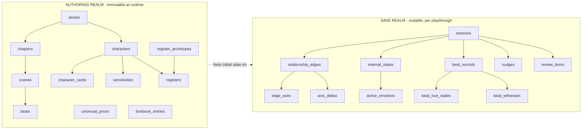

# Database — Persistence schema

> **Status: Accepted (snapshot of [ADR 0012](../adr/0012-persistence-schema.md)).** This is the column-level **living detail** of the persistence strategy decided in ADR 0012. The strategy + settled-subsystem schema are locked; O1/O2/O3 column detail is **deferred** (see §6). · **Last Updated:** 2026-06-04

> **Engine:** MySQL 8 / MariaDB 11.7 (wire-compatible; Laravel 13 `mariadb` driver). InnoDB, `utf8mb4`. JSON columns supported on both.

---

## 1. Core idea — two realms

Mirror the ADR line between **authored template data** (immutable at runtime, ADR 0001) and **evolving runtime state** (mutable, written at scene/session boundaries, ADR 0002). A `session` (a save) is a fork of the template into evolving state — which gives multi-save and reset for free.

Full ERD: [Diagrams/Data/Persistence_Erd.md](./Diagrams/Data/Persistence_Erd.md).

The **source bibles** (`luna-archi.md`, …) stay as repo markdown referenced by slug from `characters` — never injected (ADR 0001), no reason to store 50 KB of prose in the DB.

---

## 2. Normalize-vs-JSON strategy

Rule of thumb: **normalize what the engine reads/writes per-axis or queries on; JSON for nested authorial config read as a whole.**

- **Rows (normalized):** `edge_axes` (the delta engine + decay operate per axis), `axis_deltas` (append-only audit log keyed by edge+axis), `beat_true_states` / `beat_witnesses` (isolation), `active_emotions` (per-emotion decay).
- **JSON columns:** `knowledge_boundary`, `disposition_priors`, register dimension profiles + `overrides`, `topic_flags`, sensitivity `detect`/`axes`, nudge `kind`, the `scar` sub-object — read as a unit, rarely filtered by sub-field (+ a generated column if one ever needs indexing).
- **Materialized state + log:** `edge_axes`/`internal_states` hold fast current values; `axis_deltas` is the history. Not full event-sourcing (replaying clamp + latch + decay is needless complexity) — the pragmatic middle ground.

---

## 3. Authoring realm (template)

| Table | Key columns | Notes |
|-------|-------------|-------|
| `stories` | title, slug | the project |
| `characters` | story_id, slug, name, bible_path, base_opacity, live_axes (JSON), model_tier, is_player | `base_opacity` seeds register composure (ADR 0010); player = appearance-only |
| `character_cards` | character_id, chapter_id, knowledge_boundary (JSON), disposition_priors (JSON), voice (JSON), tells (JSON), folded_identity | per-chapter snapshot, immutable at runtime (ADR 0001) |
| `register_archetypes` | slug, dimensions (JSON) | shared library (one_way_mirror, romantic_deflection, …) ADR 0006 |
| `registers` | character_id, slug, archetype_id (nullable), dimensions (JSON), speech_ref, tells (JSON) | card instantiation or bespoke (transparent_mess) |
| `sensitivities` | character_id, slug, detect, targets, axes (JSON), weight, channel | authored; ADR 0005 |
| `universal_priors` | slug, detect, axes (JSON), default_weight, channel | shared appraisal library |
| `lorebook_entries` | story_id, keywords (JSON), content | keyword-injected world facts |
| `chapters` | story_id, number, title, pov_default, outline | **SKELETAL** — O1/O2 columns deferred |
| `scenes` | chapter_id, number, pov_mode, pov_anchor, tone | **SKELETAL** |
| `beats` | scene_id, number, intent, goal, word_budget | **SKELETAL** — O2 adds `BEAT_DONE` + boundary events |

---

## 4. Save realm (runtime)

| Table | Key columns | Notes |
|-------|-------------|-------|
| `sessions` | story_id, name, state_node, current_chapter/scene/beat_id, beat_word_count, chapter_word_count, resume_anchor (JSON), narrative_clock (JSON) | a save; **SKELETAL** loop fields, O1 extends |
| `relationship_edges` | session_id, from_character_id, to_character_id, register_base, register_overrides (JSON), topic_flags (JSON), meta (JSON) | directed `from→to`; unique(session, from, to) |
| `edge_axes` | relationship_edge_id, axis, value, awareness_mode, soft/hard_floor/cap, gain/loss_rate, peak_up/down, baseline, latch_threshold, latch_retain, scar (JSON) | one row per live axis; unique(edge, axis) |
| `axis_deltas` | relationship_edge_id, axis, direction, magnitude, channel, **trigger (NOT NULL)**, confidence, value_before, value_after, source, review_item_id, created_at | **APPEND-ONLY** audit log (no updated_at) |
| `internal_states` | session_id, character_id, mood, motivation, masks (JSON), last_decayed_at | **O3 extends**; unique(session, character) |
| `active_emotions` | internal_state_id, emotion, intensity, decay_rate, installed_at, source | own-clock decay (ADR 0001/0004) |
| `acquired_sensitivities` | session_id, character_id, detect, targets, axes (JSON), weight, channel, installed_by_delta_id | runtime-installed scar triggers (ADR 0005) |
| `beat_records` | session_id, beat_id, surface, pov_anchor, created_at | **APPEND-ONLY**; `surface` is the only cross-agent layer |
| `beat_true_states` | beat_record_id, character_id, private_text | **NEVER cross-fed** — separate table by design |
| `beat_witnesses` | beat_record_id, character_id, fidelity | full \| overheard \| partial (ADR 0007) |
| `nudges` | session_id, beat_id, character_id, kind (JSON), level, text, target, goal, source, is_break_glass, review_item_id, created_at | ADR 0008 |
| `review_items` | session_id, producer_type, producer_id, payload (JSON), status, edited_payload (JSON), reviewed_at, reviewed_by | shared review-gate queue (0003/0008/0010) |
| `scene_summaries` | session_id, scene_id, summary, drift_applied, decay_applied, created_at | **SKELETAL** context-memory; O1 |
| `chapter_logs` | session_id, chapter_id, events (JSON) | **SKELETAL** |
| `events` | session_id, beat_id, type, character_id, content, token_estimate, created_at | immediate-context timeline; **SKELETAL** |

---

## 5. Isolation & integrity at the DB layer

- **`beat_true_states` is split out** of `beat_records` so the assembler's "read `surface` only" query *physically cannot* pull another character's private state — the ADR 0007/0009/0010 boundary made structural.
- **Append-only tables** (`axis_deltas`, `beat_records` + children, `nudges`) carry only `created_at`; never `UPDATE`/`DELETE`. They are the source of truth for the relationship viewer and debugging.
- **Enums** (PHP enum + DB enum/string): `axis`, `awareness_mode`, `delta_channel`, `delta_source`, `fidelity`, `nudge_level`, `target`, `state_node`, `review_status`, `producer_type`.

---

## 6. Deferred (awaiting O1/O2/O3)

These columns/tables are intentionally **not** designed yet; they land with their ADR:

- **O1 (narrator loop):** richer `sessions` loop state, `scene_summaries`/`chapter_logs`/`events` shapes, in-loop sequencing markers.
- **O2 (beat document):** `beats.BEAT_DONE` criteria, boundary-event tables, nudge-derivation linkage.
- **O3 (internal-state schema):** the precise shape of `internal_states` + `active_emotions` (what writes transient emotion, mask data model, own-clock decay params).

---

## Related Documentation

- [ARCHITECTURE.md](./ARCHITECTURE.md) · [Diagrams/Data/Persistence_Erd.md](./Diagrams/Data/Persistence_Erd.md)
- ADR [0001](../adr/0001-character-data-three-layer-separation.md)–[0010](../adr/0010-recorder-mechanics.md) · [GAPS](../adr/GAPS.md) O4
