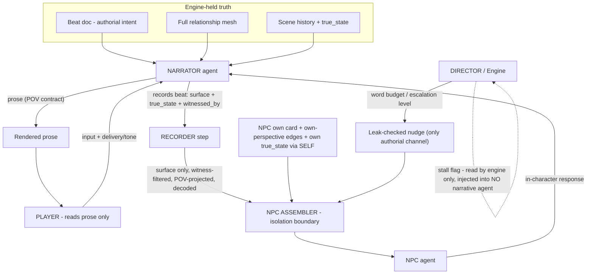

# Agent context isolation

How the three narrative agents + the Director see different slices of truth. The NPC context assembler (ADR 0007) is the mechanical enforcement point. Source: [../../../adr/0007-npc-context-assembly.md](../../../adr/0007-npc-context-assembly.md), brief "three agents".

## Read this as

- The **NPC** never receives `beat doc`, the full `mesh`, other characters' cards/edges, or any `true_state` but its own (delivered via the SELF block, not the excerpt).
- The **narrator** holds omniscient truth but is bound by the mesh-awareness rule (atmosphere / body-language only) and the POV contract.
- The **Director** is out-of-context: the stall flag never enters a narrative prompt.

See also: [Context-memory + leak guards in ARCHITECTURE.md](../../ARCHITECTURE.md#7-three-leak-guards--one-review-gate).
