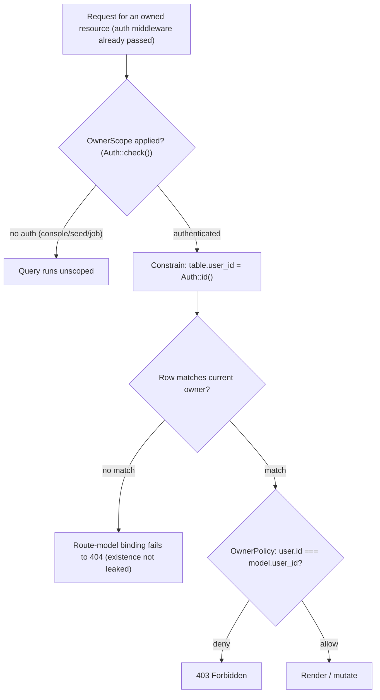
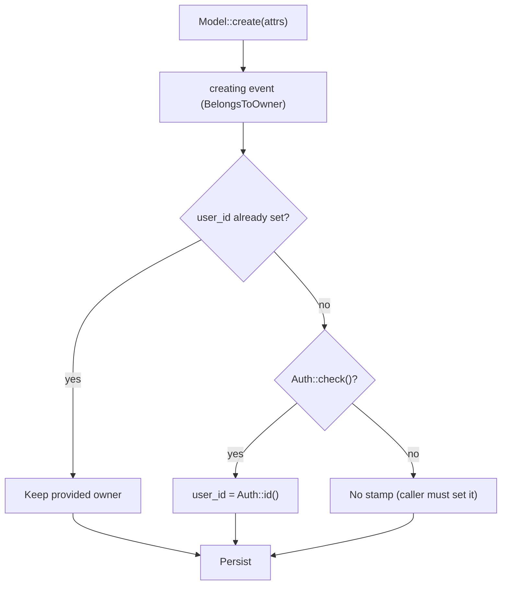

# Account Ownership & Isolation

Fail-closed, owner-scoped-by-default access for owned resources (Sprint 2 / S-2.2.2). "Multi-user" here means **account isolation only** — there is no role or admin hierarchy. Source of truth: `app/Models/Concerns/BelongsToOwner.php`, `app/Models/Scopes/OwnerScope.php`, `app/Policies/OwnerPolicy.php`.

## Read / mutate path for an owned resource

## Ownership stamping on create

## Notes

- The global scope is the **HTTP isolation boundary**: web owned-resources always sit behind `auth`, so every web query is scoped. The deliberate no-op when unauthenticated keeps console commands, seeders, and queued jobs able to operate across owners.
- `404` (scope) vs `403` (policy) is intentional: a foreign row should look like it does not exist, while a row reached out-of-scope is explicitly forbidden.
- The first real owned model is **stories** (Phase 2). The foundation is validated today by a fixture model + `tests/Feature/Auth/OwnershipIsolationTest.php`.
- `user_id` is the ownership key everywhere (matches `sessions` / `agent_conversations` and Laravel convention); the relation is named `owner()` for intent.

## Related

- [../../ARCHITECTURE.md](../../ARCHITECTURE.md) §11 — Application foundation (Sprint 2)
- [../../../api/account.md](../../../api/account.md) — account & ownership contract
- [Auth_Signin_Flow.md](./Auth_Signin_Flow.md) — sign-in & route protection
