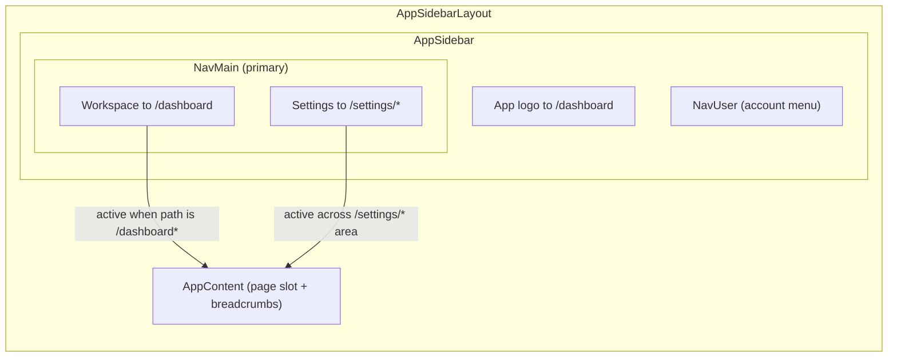
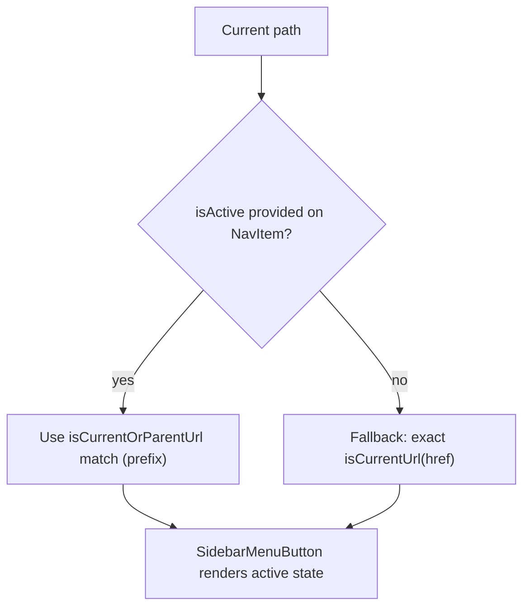
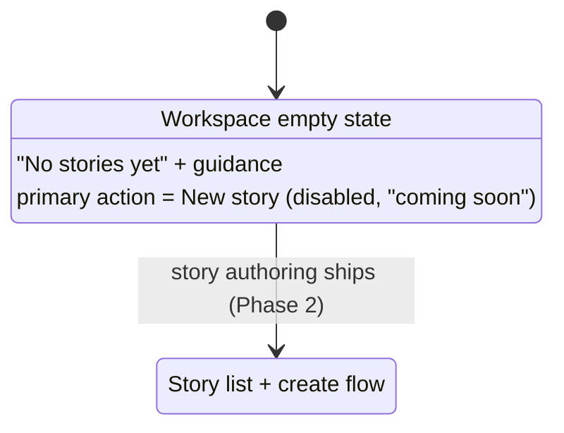

# App Shell & Navigation

The authenticated application shell and its primary navigation (Sprint 2 / S-3.1.1). Source of truth: `resources/js/components/AppSidebar.vue`, `resources/js/components/NavMain.vue`, `resources/js/pages/Dashboard.vue`, `routes/web.php`, `routes/settings.php`.

## Shell layout & primary nav

## Active-area resolution

## Workspace empty state (no stories yet)

## Notes

- Only **Workspace** + **Settings** are surfaced; **Play** is intentionally deferred to Phase 5 (no dead nav items).
- Settings links to the profile landing (`profile.edit`) but is highlighted across the entire `/settings/*` area via a prefix match, so Profile / Security / Appearance all show the Settings tab active.
- The empty state is the required **empty** UI state: it teaches the next step rather than showing a blank screen, and the create affordance is a clearly-disabled control — every surface stays reachable by navigation, with no link to an unbuilt page.
- The starter-kit external "Repository / Documentation" footer links were removed as irrelevant to the product shell.

## Related

- [../../ARCHITECTURE.md](../../ARCHITECTURE.md) §11 — Application foundation (Sprint 2)
- [Auth_Signin_Flow.md](./Auth_Signin_Flow.md) — sign-in & route protection
- [../../../manual-qa-check/ui/S-2-account-shell.md](../../../manual-qa-check/ui/S-2-account-shell.md) — manual QA path
