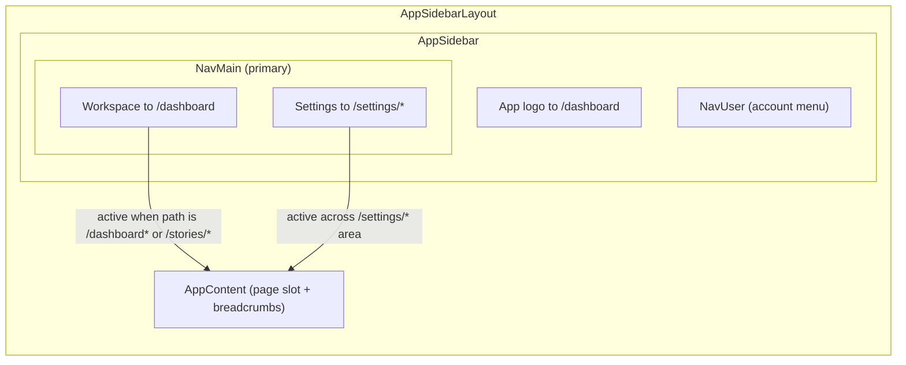
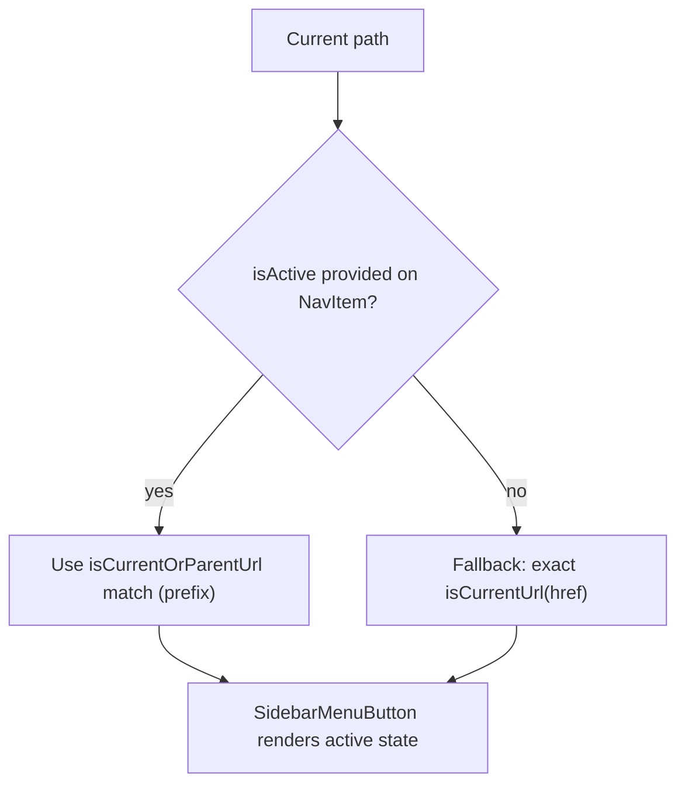
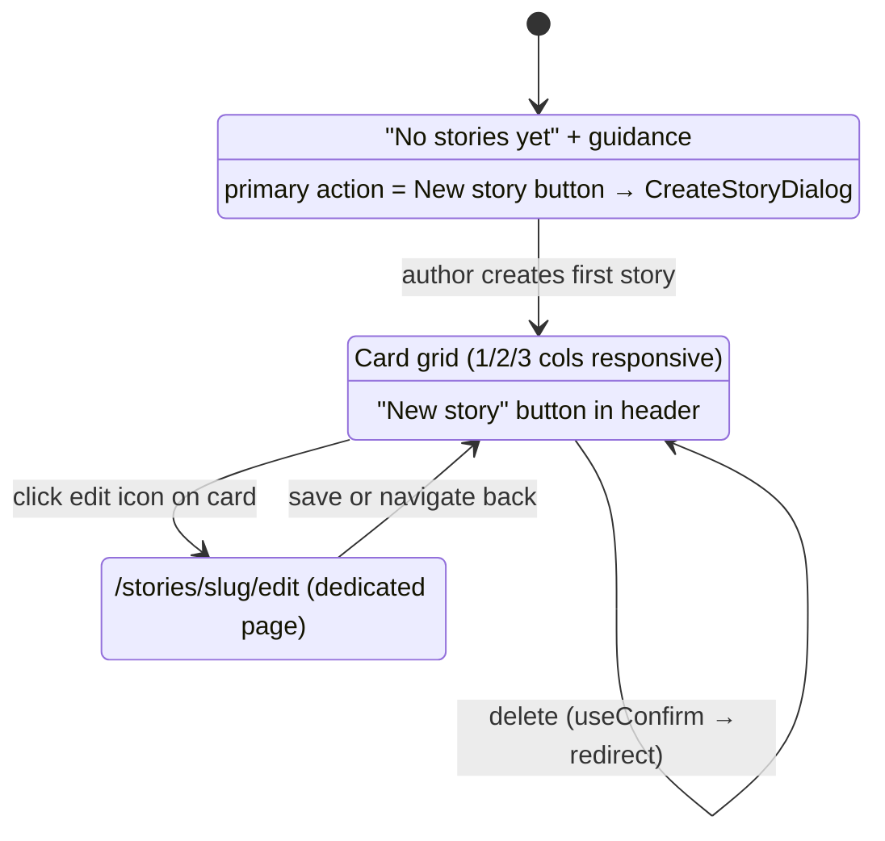

# App Shell & Navigation

The authenticated application shell and its primary navigation (Sprint 2 / S-3.1.1). Source of truth: `resources/js/components/AppSidebar.vue`, `resources/js/components/NavMain.vue`, `resources/js/pages/Dashboard.vue`, `routes/web.php`, `routes/settings.php`.

## Shell layout & primary nav

## Active-area resolution

## Workspace states (Sprint 7)

## Notes

- Only **Workspace** + **Review** + **Settings** are surfaced; **Play** is intentionally deferred to Phase 5 (no dead nav items).
- Settings links to the profile landing (`profile.edit`) but is highlighted across the entire `/settings/*` area via a prefix match, so Profile / Security / Appearance all show the Settings tab active.
- Workspace is active for both `/dashboard` and `/stories/*` paths, keeping the edit page contextually linked.
- The empty state is the required **empty** UI state: it teaches the next step with a create CTA. The populated state shows a responsive card grid with edit (pencil → dedicated page) and delete (trash → useConfirm dialog, never native `confirm()`).
- Story creation is inline via Dialog (desktop); edit is a dedicated page (room for per-story tabs in S-1.2.x).

## Related

- [../../ARCHITECTURE.md](../../ARCHITECTURE.md) §11 — Application foundation (Sprint 2)
- [Auth_Signin_Flow.md](./Auth_Signin_Flow.md) — sign-in & route protection
- [../../../manual-qa-check/ui/S-2-account-shell.md](../../../manual-qa-check/ui/S-2-account-shell.md) — manual QA path
