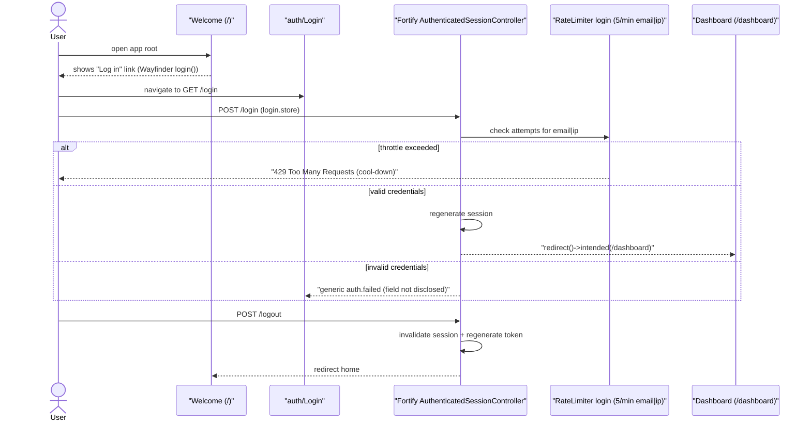
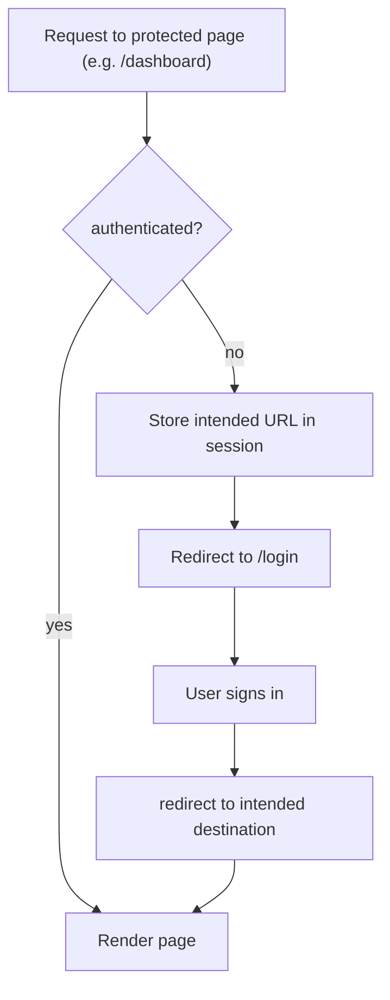

# Auth Sign-in & Route Protection

Sign-in, sign-out, and route protection for the Phase 1 / Sprint 1 application shell (Laravel Fortify). Storage is UTC; the only public surfaces are the auth pages. Source of truth: `routes/web.php`, `app/Providers/FortifyServiceProvider.php`, `config/fortify.php`.

## Sign-in / sign-out sequence

## Route protection (intended-destination)

## Notes

- `auth` guards every authoring/play surface; `verified` is also applied but is a no-op until `User` implements `MustVerifyEmail` (tracked PH-10, reconciled in Sprint 2).
- The throttle key is `Str::transliterate(Str::lower(email).'|'.ip)` — see `FortifyServiceProvider::configureRateLimiting()`.
- Times shown anywhere render in Asia/Jakarta via the shared `standards` prop + `useFormat` composable.

## Related

- [../../ARCHITECTURE.md](../../ARCHITECTURE.md) §11 — Application foundation
- [../../../api/auth.md](../../../api/auth.md) — endpoint & Inertia-props contract
- [../../../manual-qa-check/ui/S-1-foundation-auth.md](../../../manual-qa-check/ui/S-1-foundation-auth.md) — manual QA path
