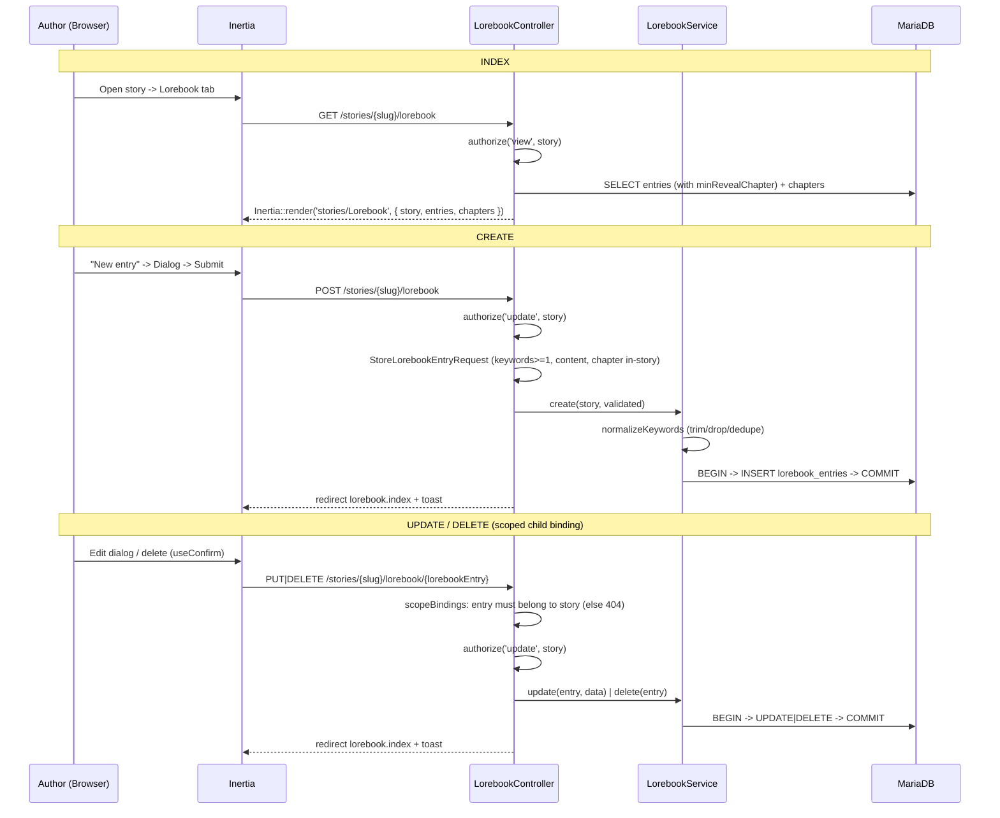

# Lorebook CRUD Flow (S-3.1.1)

> Request flow for per-story lorebook entry CRUD through the workspace UI. World facts injected on keyword match at runtime (ADR 0013 §5).

## Ownership & scoping

The parent `{story:slug}` resolves under `OwnerScope` (foreign story → 404 on binding). The child `{lorebookEntry}` uses `->scopeBindings()`, so Laravel scopes the lookup through `Story::lorebookEntries()` — an entry from another story is 404, never leaked. Authorization is on the parent `Story` (`view` for index, `update` for writes); entries carry no `user_id` and inherit isolation transitively through their story.

## Reveal gate

`min_reveal_chapter_id` is an optional FK to a chapter **of the same story** (validated). Chapters land in a later phase, so the selector is usually empty today and the UI degrades to a disabled hint. Runtime injection withholds an entry before its reveal chapter — wired with the narrator loop, not in this story.
