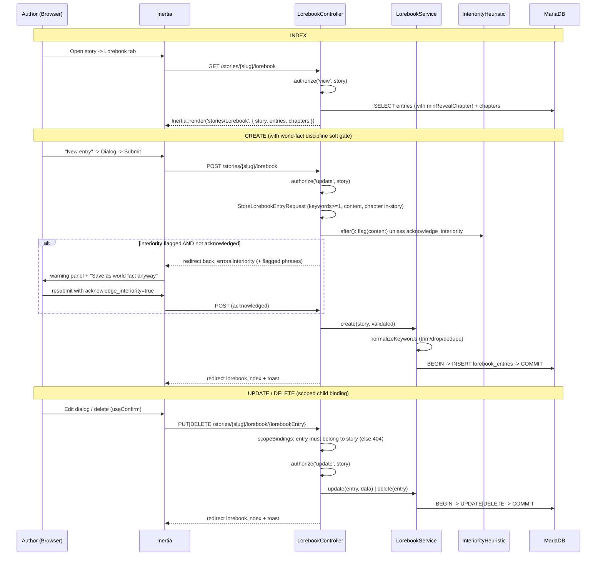
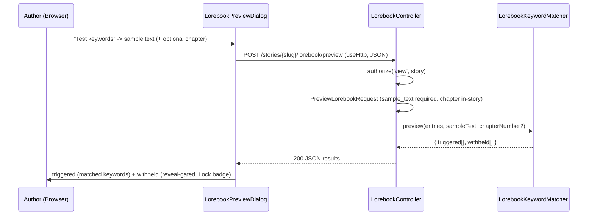

# Lorebook CRUD Flow (S-3.1.1 / S-3.1.2 / S-3.2.1)

> Request flow for per-story lorebook entry CRUD through the workspace UI, plus the world-fact discipline soft gate (S-3.1.2) and the keyword match preview (S-3.2.1). World facts injected on keyword match at runtime (ADR 0013 §5).

## Keyword match preview (S-3.2.1)

A read-only tuning aid, transported via `useHttp` (a standalone JSON request, no page visit) so the sample excerpt rides in the POST body. It uses the **canonical `LorebookKeywordMatcher`** — the same match runtime injection will reuse (PH-31).

## Ownership & scoping

The parent `{story:slug}` resolves under `OwnerScope` (foreign story → 404 on binding). The child `{lorebookEntry}` uses `->scopeBindings()`, so Laravel scopes the lookup through `Story::lorebookEntries()` — an entry from another story is 404, never leaked. Authorization is on the parent `Story` (`view` for index, `update` for writes); entries carry no `user_id` and inherit isolation transitively through their story.

## Reveal gate

`min_reveal_chapter_id` is an optional FK to a chapter **of the same story** (validated). Chapters land in a later phase, so the selector is usually empty today and the UI degrades to a disabled hint. Runtime injection withholds an entry before its reveal chapter — wired with the narrator loop, not in this story. The **preview** lets the author test this clamp ahead of runtime: pick a chapter, and entries gated later are reported as `withheld` rather than `triggered`.

## World-fact discipline (S-3.1.2)

`InteriorityHeuristic` is a deterministic, offline linter (no LLM) that scans `content` for phrases reading as a character's interiority — private feelings, hidden intent, concealed knowledge. The store/update requests run it in an `after()` hook as a **soft gate**: a flagged entry is rejected with an `interiority` error unless `acknowledge_interiority` is set, so the default keeps interiority out of the lorebook (preserving character isolation at injection time) while a false positive remains overridable. The signal list is an authored, tunable default (PH-33).
