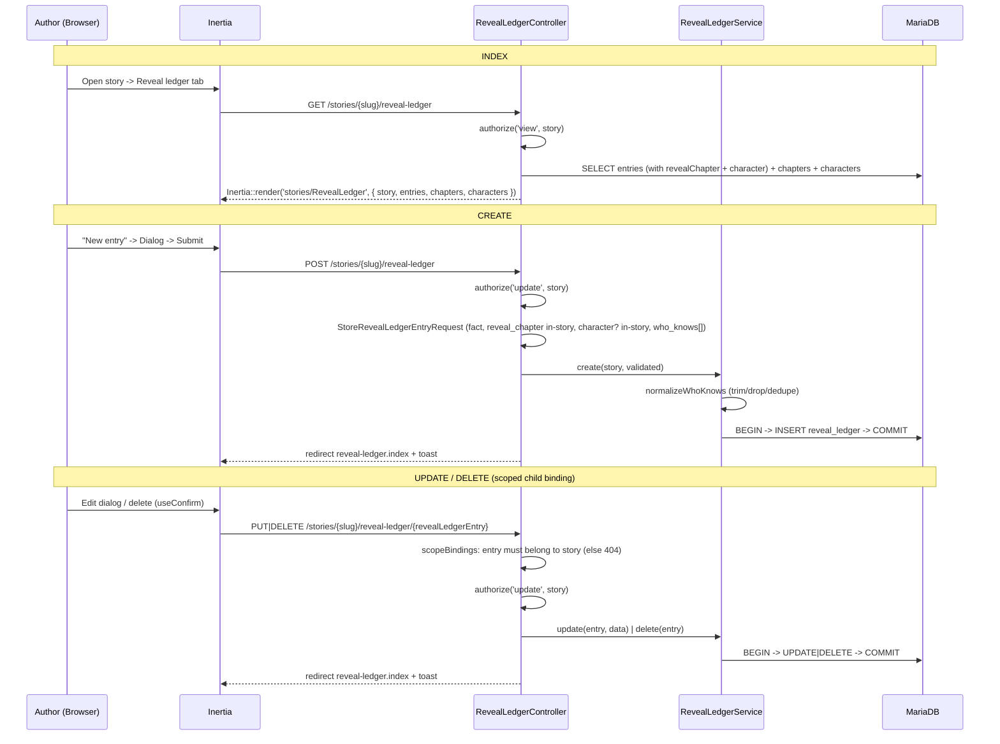

# Reveal Ledger CRUD Flow (S-4.1.1)

> Request flow for per-story reveal-ledger entry CRUD through the workspace UI. A reveal-ledger entry records a load-bearing secret `{ fact, reveal_chapter, character?, who_knows[] }` so spoiler-safety is explicit rather than inferred (ADR 0013 §3). The compile clamp that consumes the ledger, and the reveal-clamp preview (S-4.1.2), are separate and later.

## Ownership & scoping

The parent `{story:slug}` resolves under `OwnerScope` (foreign story → 404 on binding). The child `{revealLedgerEntry}` uses `->scopeBindings()`, so Laravel scopes the lookup through `Story::revealLedgerEntries()` — an entry from another story is 404, never leaked. Authorization is on the parent `Story` (`view` for index, `update` for writes); entries carry no `user_id` and inherit isolation transitively through their story.

## Reveal point & the clamp

`reveal_chapter_id` is a **required** FK to a chapter **of the same story** (validated). Chapters are authored in a later phase (Structure / Phase 4), so the selector is usually empty today; because the reveal point is mandatory, the surface **gates "New entry" behind a teaching empty state** ("Add a chapter first", linking to Structure) rather than degrading a single field. The clamp the ledger drives — exclude a fact from any card before its reveal chapter, emitting an explicit `does_not_know` on `knowledge_boundary` — is applied by the card compiler (Phase 3), not in this CRUD. The reveal-clamp **preview** (S-4.1.2) will let an author verify that clamp per chapter ahead of compile.

## who_knows & "about" character

- `who_knows` is a free-text **chip input of character slugs** — the characters exempt from the clamp for this fact. It is not existence-checked, since characters are authored in a later phase (Phase 3); a slug that names no character exempts nobody. Slugs are normalised server-side (trim / drop blanks / de-dupe) in `RevealLedgerService`.
- `character_id` (the "about" character) is **optional** and defaults to a **world secret** (null). The selector degrades to a world-secret-only hint when the story has no characters yet.

## Related

- [../../../api/reveal-ledger.md](../../../api/reveal-ledger.md) — endpoint/props contract
- [Lorebook_Crud_Flow.md](./Lorebook_Crud_Flow.md) — the sibling world-fact CRUD this mirrors
- [Story_Workspace_Shell.md](./Story_Workspace_Shell.md) — the workspace shell this surface lives in
- [../../ARCHITECTURE.md](../../ARCHITECTURE.md) — Sprint 10 (E4.1)
