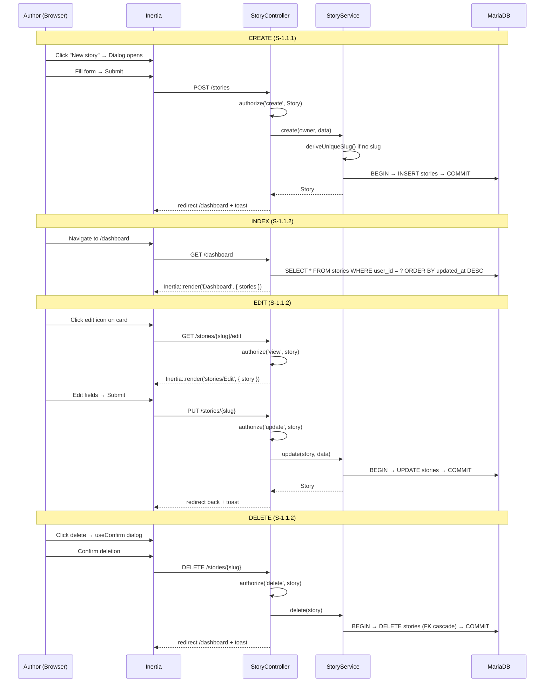

# Story CRUD Flow (S-1.1.1 / S-1.1.2)

> Request flow for story lifecycle operations through the workspace UI.

## Ownership isolation

All queries run under the `OwnerScope` global scope — a foreign story resolves to 404 on route-model binding. The `StoryPolicy` (extending `OwnerPolicy`) gates create/view/update/delete by ownership alone.

## Slug uniqueness

The `(user_id, slug)` composite unique index allows two different owners to hold the same slug. `StoryService::deriveUniqueSlug()` auto-suffixes derived slugs on per-owner collision; explicit slugs fail validation.
