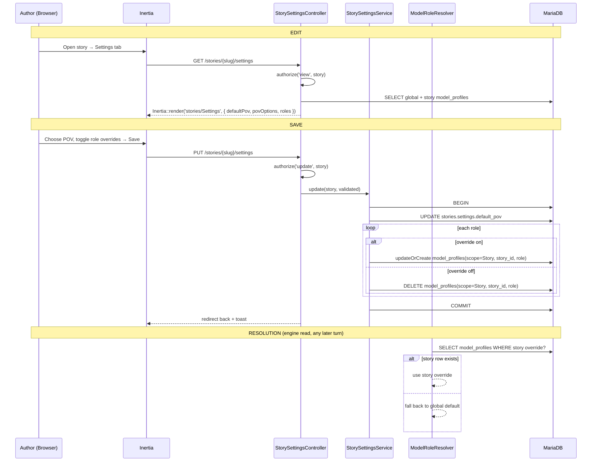
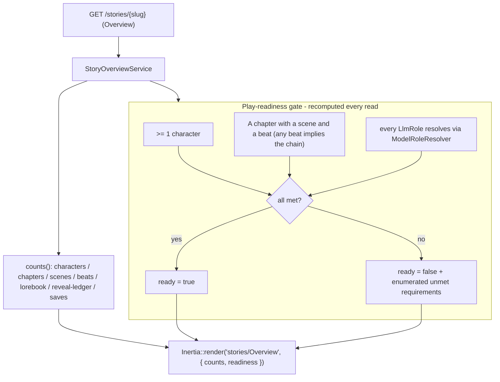

# Story Settings & Overview Flow (S-1.2.1 / S-1.2.2)

> The per-story workspace surfaces (E1.2): saving settings, resolving an
> override, and deriving the overview counts + play-readiness on read.

## Settings save + override resolution (S-1.2.1)

## Overview counts + play-readiness (S-1.2.2, derived on read)

## Notes

- **Nothing here is stored.** Counts are cheap aggregates and play-readiness is
  recomputed on each overview read; neither is cached or persisted.
- **Owner scope.** `{story:slug}` binds under `OwnerScope`, so a foreign story
  404s on every surface (Overview / Details / Settings).
- **Resolution order** is always per-story override → global default, reusing the
  existing `ModelRoleResolver`. The readiness "model" check catches
  `UnresolvedModelRoleException` and lists the unresolved roles.
- **Deferred:** per-story rubric/elapsed/drift tunable overrides (PH-29) wait on
  a global rubric config home (PH-8); Settings ships POV + model roles only.
