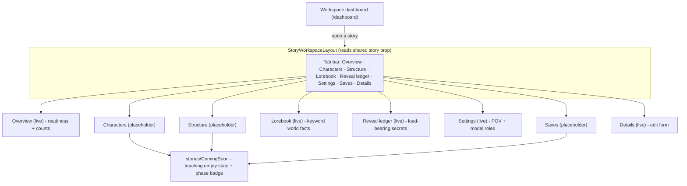
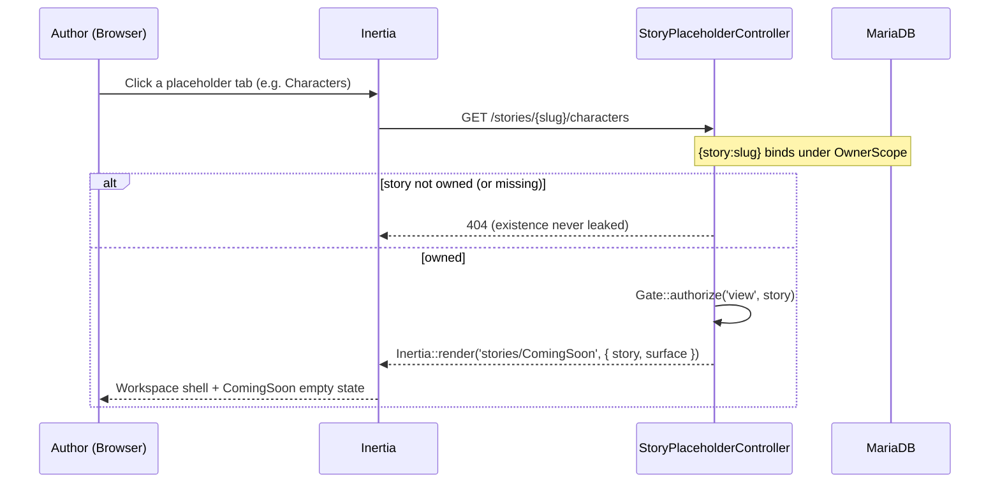

# Story Workspace Shell (E2.1 / S-2.1.1)

> The per-story authoring workspace: a single tab shell that spans every
> authoring surface, scoped to one story. Live surfaces render their feature;
> the not-yet-built surfaces render a reachable "coming soon" placeholder
> so the shell shows its full shape without dead nav items. (Lorebook shipped its
> real CRUD in E3.1 — see [Lorebook_Crud_Flow.md](./Lorebook_Crud_Flow.md).)
> Source of truth:
> `resources/js/layouts/stories/Layout.vue`, `app/Http/Controllers/Stories/StoryPlaceholderController.php`,
> `resources/js/pages/stories/ComingSoon.vue`, `routes/web.php`.

## Workspace navigation

## Placeholder surface request (owner-scoped)

## Surface map

| Surface | Status | Route name | Resolves in |
|---------|--------|------------|-------------|
| Overview | live | `stories.show` | E1.2 (shipped) |
| Characters | placeholder | `stories.characters.index` | Phase 3 (O5 character creation) |
| Structure | placeholder | `stories.structure.index` | Phase 4 (O6 outline compiler) |
| Lorebook | live | `stories.lorebook.index` | E3.1 (shipped) — [Lorebook_Crud_Flow.md](./Lorebook_Crud_Flow.md) |
| Reveal ledger | live | `stories.reveal-ledger.index` | E4.1 (shipped) — [Reveal_Ledger_Crud_Flow.md](./Reveal_Ledger_Crud_Flow.md) |
| Settings | live | `stories.settings.edit` | E1.2 (shipped) |
| Saves | placeholder | `stories.saves.index` | Phase 5 (session) |
| Details | live | `stories.edit` | E1.1 (shipped) |

## Notes

- **No dead nav items.** Placeholders are reachable pages with a teaching empty
  state, not links to nowhere — consistent with the PH-15 rule and the standing
  "every page reachable via navigation" rule. Tracked as **PH-30**.
- **Owner scope on every surface.** Each route binds `{story:slug}` under
  `OwnerScope`, so a foreign story 404s on every tab; switching stories
  re-scopes the entire shell.
- **Readiness is not a tab.** Play-readiness (S-2.1.2) lives on the **Overview**
  surface — the default landing tab — and is a derived gate (see
  [Story_Settings_Overview_Flow.md](./Story_Settings_Overview_Flow.md)).
- **Replaceable.** When a surface's feature ships, its route is repointed at the
  real controller and the placeholder method is removed; the shell is untouched.

## Related

- [../../ARCHITECTURE.md](../../ARCHITECTURE.md) §Sprint 7 — Authoring workspace shell (E2.1)
- [Story_Settings_Overview_Flow.md](./Story_Settings_Overview_Flow.md) — Overview counts + play-readiness
- [Story_Crud_Flow.md](./Story_Crud_Flow.md) — story create / edit / delete
- [../App/App_Shell_Navigation.md](../App/App_Shell_Navigation.md) — primary (sidebar) navigation
- [../../../api/stories.md](../../../api/stories.md) — endpoint/props contract
