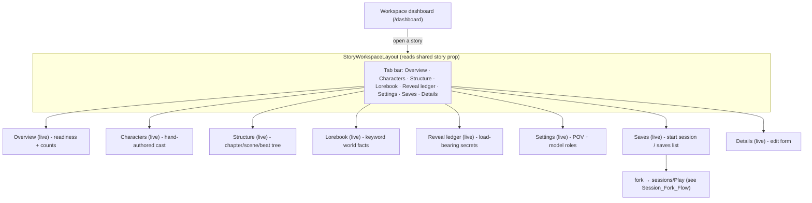
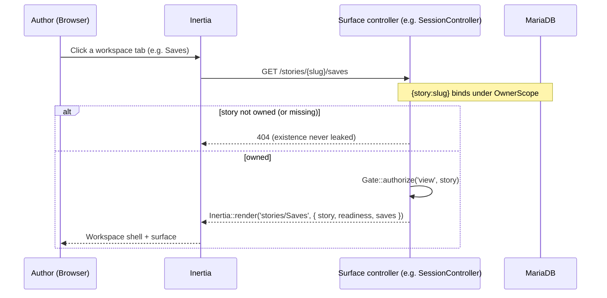

# Story Workspace Shell (E2.1 / S-2.1.1)

> The per-story authoring workspace: a single tab shell that spans every
> authoring surface, scoped to one story. **Every surface is now live** — the
> shared "coming soon" placeholder mechanism is retired as of S-2.1.1, when the
> last placeholder (**Saves**) shipped as the session-fork surface
> (see [../Engine/Session_Fork_Flow.md](../Engine/Session_Fork_Flow.md)). The
> real CRUD/feature flows: Characters E1.1 ([Character_Crud_Flow.md](./Character_Crud_Flow.md)),
> Structure E1.2 ([Structure_Crud_Flow.md](./Structure_Crud_Flow.md)),
> Lorebook E3.1 ([Lorebook_Crud_Flow.md](./Lorebook_Crud_Flow.md)),
> Reveal ledger E4.1 ([Reveal_Ledger_Crud_Flow.md](./Reveal_Ledger_Crud_Flow.md)).
> (**PH-30 resolved** — `StoryPlaceholderController` + `stories/ComingSoon.vue`
> are removed.) Source of truth:
> `resources/js/layouts/stories/Layout.vue`, `routes/web.php`.

## Workspace navigation

## Workspace surface request (owner-scoped)

Every surface follows the same owner-scoped binding pattern (its own controller now that all are live):

## Surface map

| Surface | Status | Route name | Resolves in |
|---------|--------|------------|-------------|
| Overview | live | `stories.show` | E1.2 (shipped) |
| Characters | live | `stories.characters.index` | E1.1 (shipped) — [Character_Crud_Flow.md](./Character_Crud_Flow.md) |
| Structure | live | `stories.structure.index` | E1.2 (shipped) — [Structure_Crud_Flow.md](./Structure_Crud_Flow.md) |
| Lorebook | live | `stories.lorebook.index` | E3.1 (shipped) — [Lorebook_Crud_Flow.md](./Lorebook_Crud_Flow.md) |
| Reveal ledger | live | `stories.reveal-ledger.index` | E4.1 (shipped) — [Reveal_Ledger_Crud_Flow.md](./Reveal_Ledger_Crud_Flow.md) |
| Settings | live | `stories.settings.edit` | E1.2 (shipped) |
| Saves | live | `stories.saves.index` | E2.1 / S-2.1.1 (shipped) — [../Engine/Session_Fork_Flow.md](../Engine/Session_Fork_Flow.md) |
| Details | live | `stories.edit` | E1.1 (shipped) |

## Notes

- **No dead nav items.** Every tab is now a live, reachable surface — the
  shared placeholder mechanism that bridged the gap (PH-30) is retired now that
  Saves shipped (S-2.1.1). The standing "every page reachable via navigation"
  rule still holds: the fresh-fork **Play** surface is itself a reachable stub
  (PH-36) until its reader ships (S-5.4.1).
- **Owner scope on every surface.** Each route binds `{story:slug}` under
  `OwnerScope`, so a foreign story 404s on every tab; switching stories
  re-scopes the entire shell.
- **Readiness is not a tab.** Play-readiness (S-2.1.2) lives on the **Overview**
  surface — the default landing tab — and is a derived gate (see
  [Story_Settings_Overview_Flow.md](./Story_Settings_Overview_Flow.md)).
- **Shell stability.** As each surface shipped, its route was repointed at the
  real controller without touching the shell — the workspace layout is now
  feature-complete across all eight tabs.

## Related

- [../../ARCHITECTURE.md](../../ARCHITECTURE.md) §Sprint 7 — Authoring workspace shell (E2.1)
- [Story_Settings_Overview_Flow.md](./Story_Settings_Overview_Flow.md) — Overview counts + play-readiness
- [Story_Crud_Flow.md](./Story_Crud_Flow.md) — story create / edit / delete
- [../App/App_Shell_Navigation.md](../App/App_Shell_Navigation.md) — primary (sidebar) navigation
- [../../../api/stories.md](../../../api/stories.md) — endpoint/props contract
