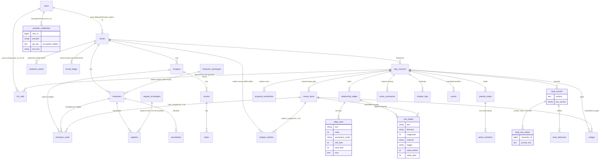

# Persistence ERD

Two-realm schema, the living detail of [ADR 0012](../../../adr/0012-persistence-schema.md). See [../../DATABASE.md](../../DATABASE.md) for column detail. The **authoring realm + `stories` ownership** is built as of Sprint 3 (S-4.1.1); the **save realm + global libraries** are **built as of Sprint 4** (S-4.2.1 / S-4.1.2), along with the owner-scoped **`provider_credentials`** key store (S-5.1.1).

> Authoring-realm entities (top block) are immutable at runtime; save-realm entities (bottom block) are per-`play_session`. `beat_true_states` is deliberately a child table of `beat_records`, not a column, to make cross-feeding structurally impossible.
>
> **`sessions` → `play_sessions` (Sprint 4, PH-17).** DATABASE.md §4.1 names the save "session"; it is built as **`play_sessions`** because the framework owns the `sessions` table for the database session driver. Child FK columns keep the spec name `session_id`.
>
> **Ownership.** `stories`, `provider_credentials`, and (as of Sprint 5) **`llm_calls`** carry `user_id` (`BelongsToOwner`; the `OwnerScope` auto-filters them). `llm_calls.user_id` is **nullable** (PH-20): both `session_id` and `story_id` are nullable — authoring-time calls have neither — so neither can carry ownership, and nullable keeps unauthenticated console/seed inserts valid while real calls always stamp the owner. Authoring children (chapters, scenes, characters, …) and other save-realm children have **no `user_id`** — they are isolated **transitively** through their story / save and `cascadeOnDelete` when it is removed. The three Sprint-3 deferred FKs are now real constraints (PH-16 resolved).
>
> **Global libraries (no story/session FK, app-wide):** `register_archetypes`, `universal_priors`, `character_archetypes` (ADR 0018), `prompt_blocks` (ADR 0020), and `model_profiles` (ADR 0017; `story_id` nullable for per-story override) sit outside both realms — only `register_archetypes → registers` is FK-scoped and shown above.
