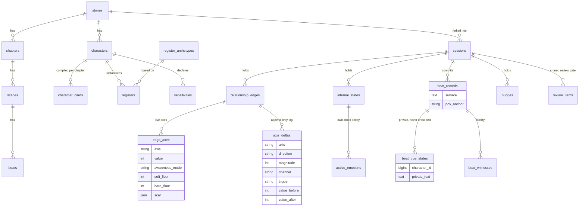

# Persistence ERD (draft)

Two-realm schema for open item **O4**. See [../../DATABASE.md](../../DATABASE.md) for column detail. **DRAFT** until the persistence ADR lands.

> Authoring-realm entities (top block) are immutable at runtime; save-realm entities (bottom block) are per-`session`. `beat_true_states` is deliberately a child table of `beat_records`, not a column, to make cross-feeding structurally impossible.
