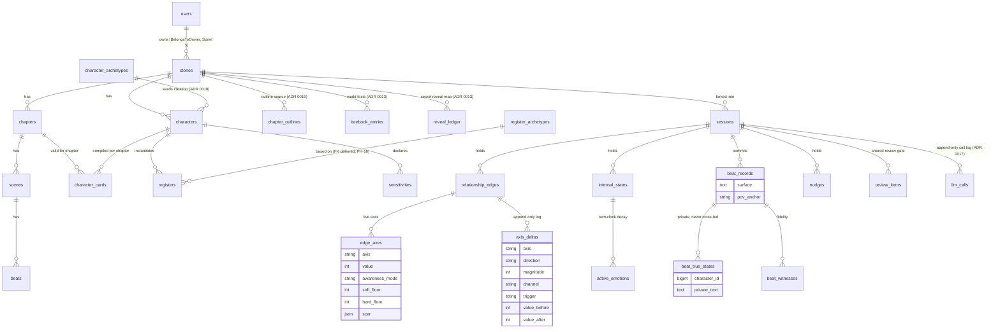

# Persistence ERD

Two-realm schema, the living detail of [ADR 0012](../../../adr/0012-persistence-schema.md). See [../../DATABASE.md](../../DATABASE.md) for column detail. The **authoring realm + `stories` ownership** (solid edges below) is **built as of Sprint 3** (S-4.1.1); the save realm and global libraries land in Sprint 4.

> Authoring-realm entities (top block) are immutable at runtime; save-realm entities (bottom block) are per-`session`. `beat_true_states` is deliberately a child table of `beat_records`, not a column, to make cross-feeding structurally impossible.
>
> **Ownership (Sprint 3).** Only `stories` carries `user_id` (`BelongsToOwner` + `StoryPolicy`); the `OwnerScope` auto-filters `stories` alone. Authoring children (chapters, scenes, characters, …) have **no `user_id`** — they are isolated **transitively** through their story and `cascadeOnDelete` when it is removed (see PH-16).
>
> **Global libraries (no FK, app-wide):** `register_archetypes`, `universal_priors`, `character_archetypes` (ADR 0018), `prompt_blocks` (ADR 0020), and `model_profiles` (ADR 0017; `story_id` nullable for per-story override) sit outside both realms — omitted from the diagram's relationships since they are not FK-scoped to a story or session.
