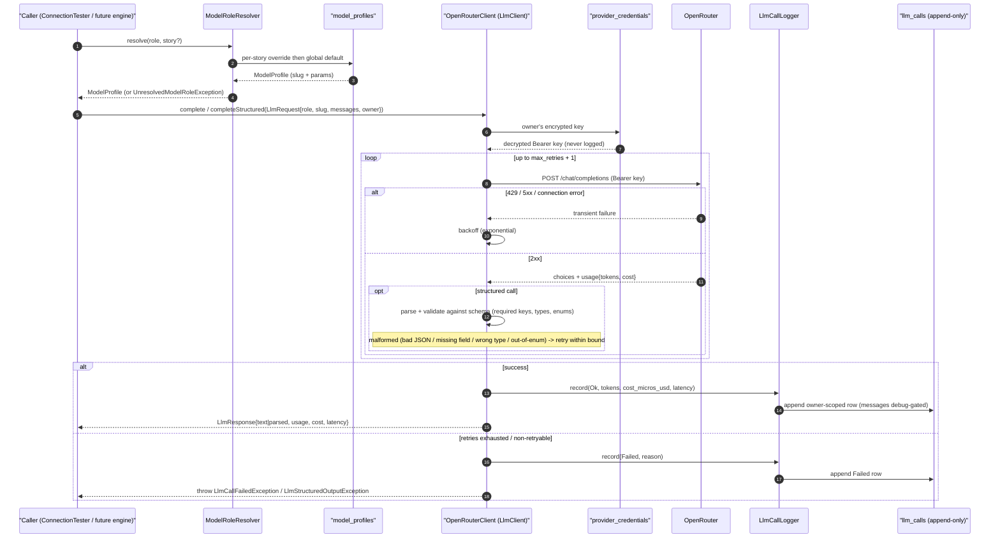

# LLM Client Flow

How an engine call flows through the role resolver, the thin OpenRouter client (with retry/backoff + structured validation), and the append-only logger — the implementation of [ADR 0017](../../../adr/0017-llm-orchestration-openrouter.md) built in Sprint 5. The client is **dumb transport**: context isolation stays upstream in the assembler and leak guards; the client sends whatever messages it is handed and authenticates with the **owner's** key.

> **Structured validation (S-4.2.2).** A structured call validates the parsed payload against the schema's `required` keys, property `type`s, **and any declared `enum`** — so an out-of-vocabulary value (e.g. a `handoff` the loop can't route this phase) is treated as malformed, not trusted. Malformed/non-conforming output is retried with backoff up to `max_retries`, then recorded as a `Failed` row and surfaced as `LlmStructuredOutputException`; the engine never receives unvalidated data as if it were valid. The first consumer is the [narrator prose call](./Narrator_Turn_Prose_Call.md).
>
> The **connection test** (S-5.1.2) is a sibling of this flow but a key-validation probe, not a role call: it hits `GET /models` with the owner's key and **does not** write `llm_calls`.
>
> Cost is captured as the provider-reported USD value (`usage.cost`) and stored as integer USD micro-units (`cost_micros_usd`); the Usage surface renders it in USD (PH-12). The `llm_calls` log is **save-realm-sensitive** — full message bodies persist only behind the `services.openrouter.log_messages` gate and are `#[Hidden]`.
