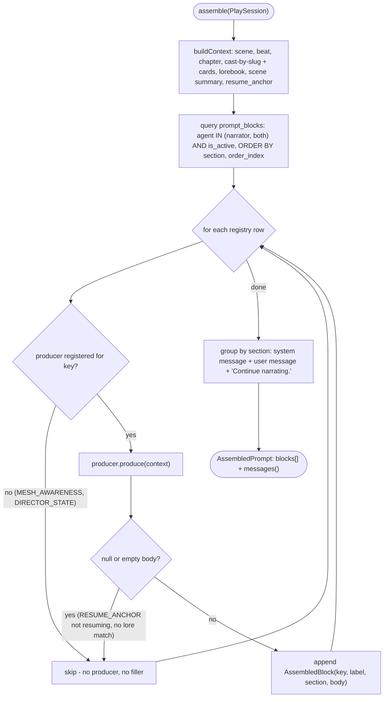
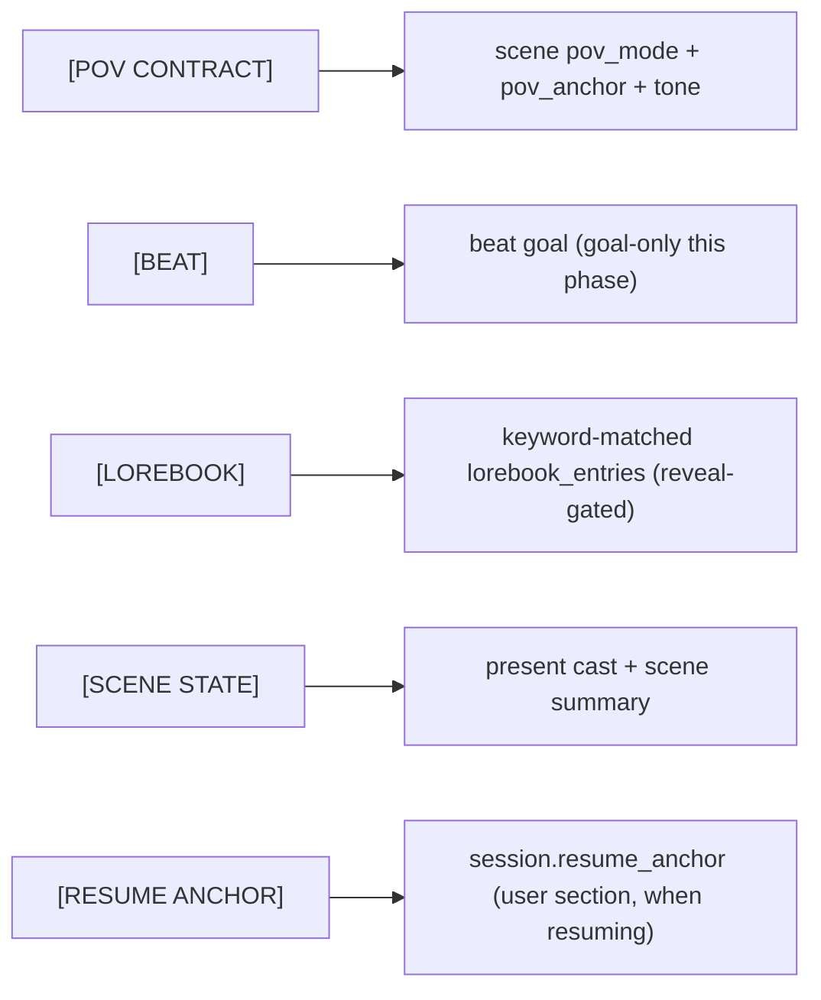

# Narrator prompt assembly

The narrator turn's prompt builder (S-4.1.1). Source: [`app/Services/Narrator/NarratorPromptAssembler.php`](../../../../app/Services/Narrator/NarratorPromptAssembler.php), driven by the seeded [`prompt_blocks` registry](../../../adr/0020-prompt-block-registry.md) (ADR 0020) per the narrator context inventory ([ADR 0016](../../../adr/0016-narrator-agent-and-turn-loop.md) §2).

## Lit blocks this phase

Selection and order are read from the registry rows, never code constants. The lit narrator blocks (each with a producer) and their data source:

- `POV_CONTRACT` (system, order 1) — [`PovContractProducer`](../../../../app/Services/Narrator/Blocks/PovContractProducer.php); folds `scenes.pov_mode`/`pov_anchor`/`tone` (ADR 0009). The anchor is a character slug (PH-35), resolved to a name. Leak: none.
- `BEAT` (system, order 3) — [`BeatProducer`](../../../../app/Services/Narrator/Blocks/BeatProducer.php); the beat `goal` only this phase (`intent`/`word_budget` are Phase 4, PH-35). Leak: omniscient_authoring.
- `LOREBOOK_NARRATOR` (system, order 5, label `[LOREBOOK]`) — [`LorebookProducer`](../../../../app/Services/Narrator/Blocks/LorebookProducer.php); reuses [`LorebookKeywordMatcher`](../../../../app/Services/LorebookKeywordMatcher.php) (PH-31). Narrator is omniscient (no knowledge clamp) but the per-entry minimum-reveal-chapter gate still holds. Leak: none.
- `SCENE_STATE` (system, order 6) — [`SceneStateProducer`](../../../../app/Services/Narrator/Blocks/SceneStateProducer.php); present cast (name + appearance from the current-chapter card) + scene summary when present. The bounded immediate-context window + canonical scene log feed in at E5.2. Leak: none.
- `RESUME_ANCHOR` (user, order 7) — [`ResumeAnchorProducer`](../../../../app/Services/Narrator/Blocks/ResumeAnchorProducer.php); renders `play_sessions.resume_anchor`, present only when resuming. The anchor's content is produced on pause in S-5.3.1. Leak: none.

## Deferred blocks (absent, no filler)

`MESH_AWARENESS` (order 2) and `DIRECTOR_STATE` (order 4) are seeded `is_active = true`, but have **no producer** this phase, so the assembler skips them — `is_active` is not the exclusion mechanism (PH-39). Their producers (the relationship mesh, the engine clock) light up in Phase 4 by registering a producer for the key, with no assembler change.

## Output → transport

`AssembledPrompt::messages()` groups system-section blocks into one `system` message and user-section blocks into the `user` message, which always closes with `Continue narrating.`. The assembler folds **deterministically** (template, not the `compiler` LLM role); the `compile_instruction` LLM-fold path is deferred (PH-25/PH-39). The structured prose call (S-4.2.1) resolves the `narrator_prose` model role, wraps the messages in an [`LlmRequest`](../../../../app/Services/Llm/Data/LlmRequest.php), and sends it via [`LlmClient`](../../../../app/Contracts/Llm/LlmClient.php) — see [Llm_Client_Flow.md](./Llm_Client_Flow.md). The turn sits on the `narrator_turn` node of the [session state machine](./Session_State_Machine.md).
