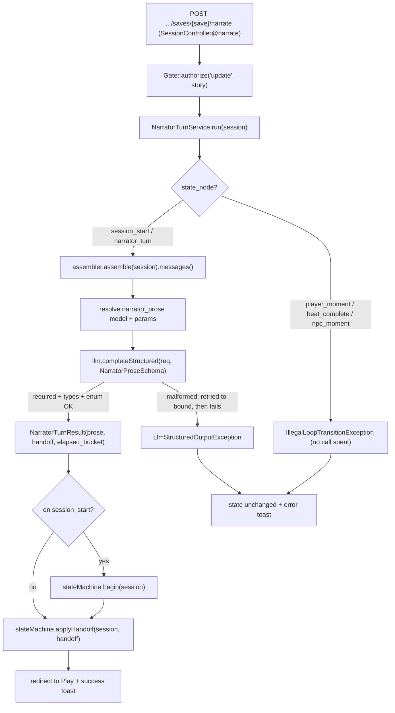

# Narrator turn — structured prose call

How one narrator turn runs: the **handoff producer** the [state machine](./Session_State_Machine.md) was built to consume. [`NarratorTurnService`](../../../../app/Services/Narrator/NarratorTurnService.php) assembles the registry-driven prompt ([S-4.1.1](./Narrator_Prompt_Assembly.md)), resolves the `narrator_prose` model, and runs **one structured call** that returns `prose · handoff · elapsed_bucket` together — so handoff detection is the prose call's own output, not a separate classifier pass (ADR 0016 §4). The implementation of S-4.2.1 (the success path) and S-4.2.2 (malformed output is retried then surfaced, never trusted).

## Why the call runs before any transition

The LLM call happens **before** the spine is touched, so a malformed or failed call surfaces without advancing the loop — the loop never trusts an unparseable result (S-4.2.2). Only a validated `NarratorTurnResult` advances the spine: the save enters the loop if this is the opening turn (`begin`), then routes by the structured `Handoff` (`applyHandoff`). On failure the prior position stays loadable and the player simply retries.

## The schema contract (`NarratorProseSchema`)

The single source of the narrator prose contract, validated by the [LLM client](./Llm_Client_Flow.md):

| Field | Type | Constraint |
|-------|------|------------|
| `prose` | string | required — the narrated text |
| `handoff` | string (enum) | required — **`player_moment` \| `beat_complete`** this phase (`npc_moment` is a valid `Handoff` but its branch lights up in Phase 2, so it is excluded from the enum) |
| `elapsed_bucket` | string (enum) | required — every `ElapsedBucket` case; captured + validated now, consumed by decay in Phase 5 |

An out-of-vocabulary `handoff` is **non-conforming**, so it is retried with backoff, then recorded as a `Failed` `llm_calls` row and surfaced as an error toast — never routed.

## Scope this slice

- **Backend + tests only.** The endpoint exists and is throttled, but its reachable advance control + the prose reader land with **S-5.4.1** (the current `sessions/Play` is a placeholder, PH-36).
- **Persistence deferred.** The turn returns the structured result and advances `state_node`; writing the prose/handoff/elapsed into the immediate-context `events` scene log is **S-5.2.1** (PH-40). `resume_anchor` content is **S-5.3.1**.

> Tested in [`tests/Feature/Narrator/NarratorTurnTest.php`](../../../../tests/Feature/Narrator/NarratorTurnTest.php) (success advances the loop; malformed is retried, recorded `Failed`, surfaced, and never advances; off-turn is rejected) and the enum-hardening case in [`tests/Feature/Llm/StructuredOutputRetryTest.php`](../../../../tests/Feature/Llm/StructuredOutputRetryTest.php).
