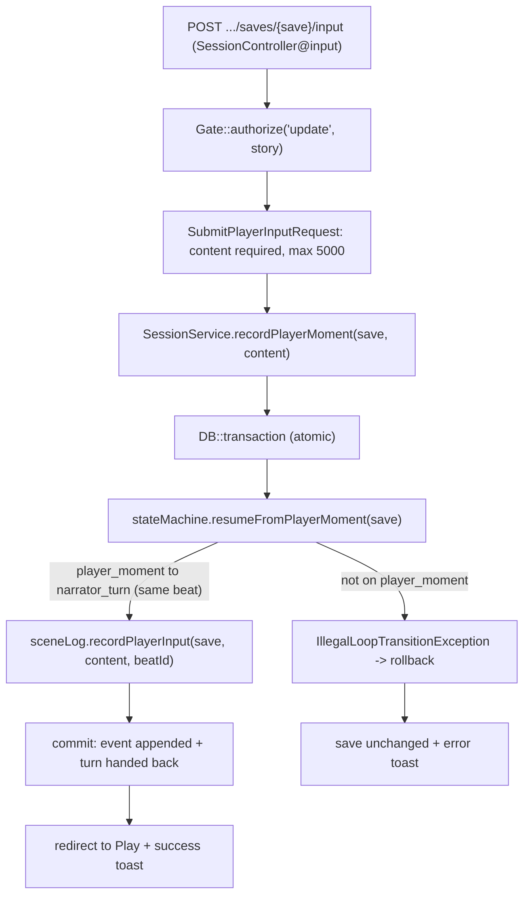

# Player moment — commit the player's contribution

How the **player half** of the loop runs (S-5.1.1). When a narrator turn hands off with `player_moment`, the Writing/Play page renders the composer; submitting drives [`SessionController@input`](../../../../app/Http/Controllers/Stories/SessionController.php), which delegates to [`SessionService::recordPlayerMoment()`](../../../../app/Services/SessionService.php). That one service method **hands the turn back to the narrator and appends the input to the scene log inside a single transaction**, so the loop never persists a hand-off without its input (or the reverse). The save stays on the same beat — the narrator continues from the player's prose rather than restarting (ADR 0016 §5).

## Why the writes are atomic

The hand-off (`resumeFromPlayerMoment`: `player_moment → narrator_turn`) and the scene-log append are **two writes that must agree**: a turn handed back without the player's prose would leave the next narrator turn narrating from nothing, and a recorded input without the hand-off would strand the loop on `player_moment`. Wrapping both in `DB::transaction` (the same posture as `SessionService::fork`/`reset`) makes a mid-turn failure roll the whole moment back — the save stays exactly on `player_moment` with nothing recorded, and the player simply retries. The node guard runs **first**, so acting off-turn throws before anything is written.

## What the player writes

This phase stores the player's input as **plain prose** in the immediate-context `events` scene log (`type = player_input`, anchored to `beat_id`). The human supplies the behaviour — `is_player` is never simulated, so the engine does not generate the player's action. Sourced delivery (prose → tone tag → infer/ask) and recording into the two-layer record arrive in **Phase 2**, where an NPC must witness the player's surface.

## Scope this slice

- **Beat unchanged.** The save stays on the same beat; only `state_node` moves (`player_moment → narrator_turn`). The narrator's continuation is the next `narrate` turn ([Narrator turn — prose call](./Narrator_Turn_Prose_Call.md)).
- **No leak guard.** No NPC consumes the player's surface yet (Phase 2), so the input is recorded verbatim.

> Tested in [`tests/Feature/Sessions/PlayLoopTest.php`](../../../../tests/Feature/Sessions/PlayLoopTest.php): input is recorded to the scene log; the turn is handed back to the narrator; acting off-turn is rejected and logs nothing; content is required; and a failed mid-turn scene-log write rolls the whole player moment back (atomicity).
