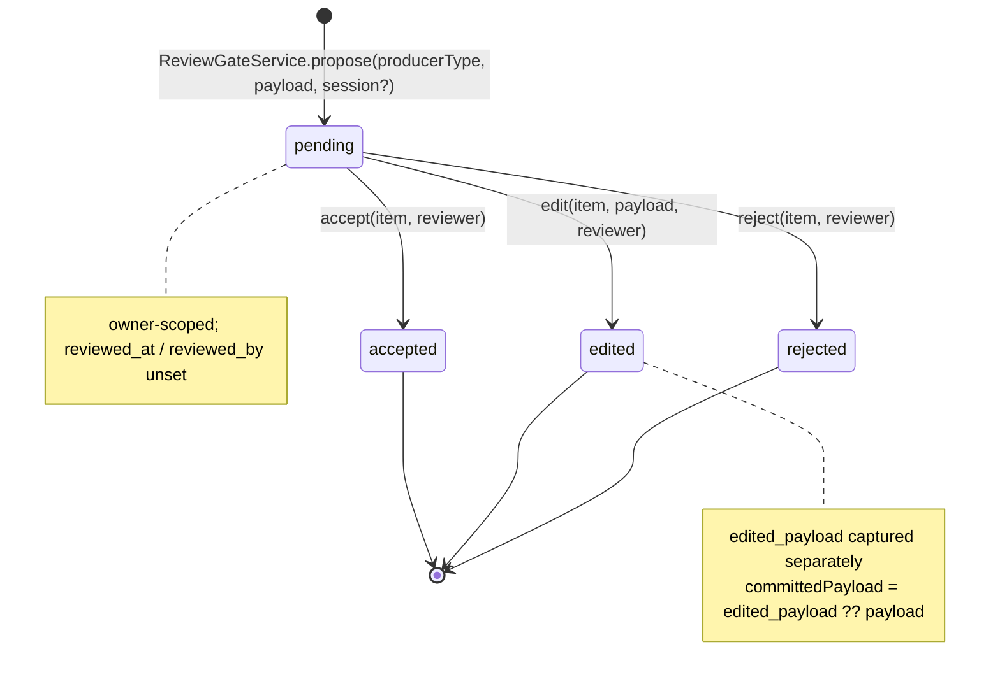
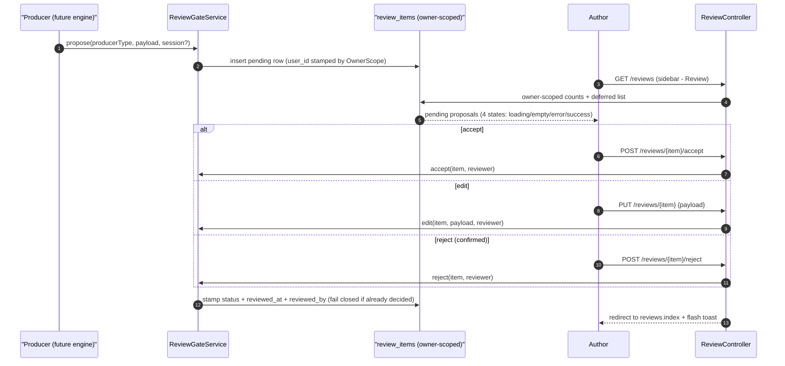

# Review Gate Flow

How a proposal moves through the shared review gate — the foundation built in Sprint 6 (S-6.2, [ADR 0003](../../../adr/0003-relationship-edge-schema.md) / [ADR 0012](../../../adr/0012-persistence-schema.md) §5). Every engine producer (deltas, nudge/card/outline/bible compiles, beat records) enqueues into one queue; the author decides each item exactly once. Authoring-time compiles enqueue with a **null `session_id`** and are still owner-isolated through a direct `user_id` (PH-20). The committed value is `edited_payload ?? payload`; the per-producer commit handlers that write that value into the delta/beat/card tables are deferred to Phase 7 E4 (PH-27).

> A decision **fails closed**: deciding an item that is no longer `pending` throws `ReviewAlreadyDecidedException` (surfaced as an "already reviewed" toast) rather than overwriting the recorded who/when.
>
> The gate route binds `{reviewItem}` under the owner global scope, so another author's proposal resolves to a **404** — never visible, never actionable (asserted by `ReviewGateTest`). The review UI renders only the proposed payload; a character's private `true_state` is never surfaced here.
