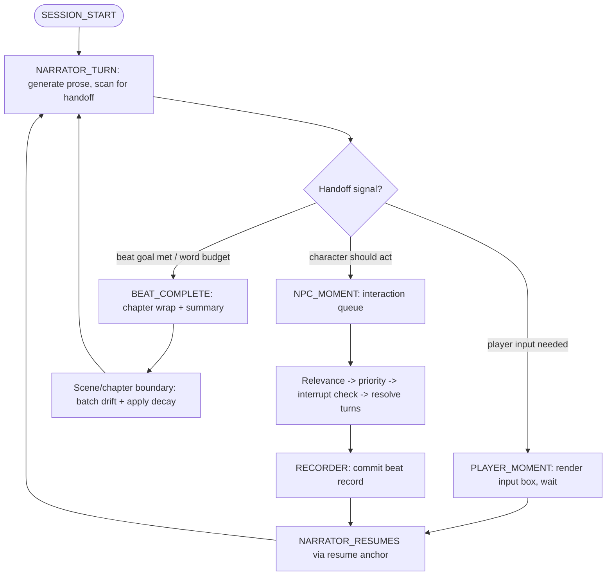

# Session state machine

The runtime spine. Source: brief "session state machine", [../../../adr/GAPS.md](../../../adr/GAPS.md) (the flow). The loop *internals* are open item **O1**.

## Where the subsystems fire (O1 must pin this down)

- **Appraisal** (ADR 0003/0005) runs after a beat's events → emits delta proposals → review gate.
- **Recorder** (ADR 0010) runs after each beat, before NPC turns that react to it.
- **Decay** (ADR 0004) runs at scene/chapter boundaries, scaled by declared in-world elapsed time.
- **Nudge escalation** (ADR 0008) is clocked by per-beat word budget + goal-not-met.

> The state machine is the conductor; O1 defines the loop internals, not a new orchestrator.

## Entry & reset (S-2.1.2 / S-2.1.3)

A save is **persisted at** `state_node = session_start` when forked, and a **reset** ([Session_Fork_Flow.md](./Session_Fork_Flow.md)) returns an existing save to that same entry node (re-positioned at the first beat, loop counters cleared). **Loading** a save re-enters the machine at its *persisted* `state_node` — never forced back to `session_start` — so play continues exactly where it paused (the `resume_anchor` feeds `NARRATOR_RESUMES`). The producers that move a save off `session_start` (the spine in S-3.1.1, the resume anchor in S-5.3.1) are later — see PH-37.
