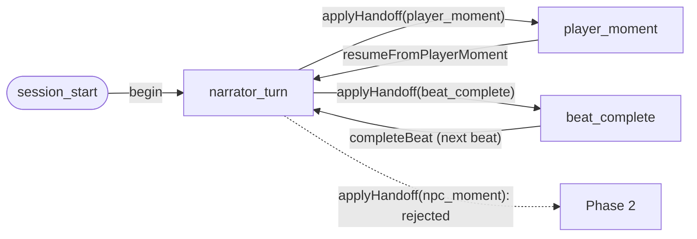

# Session state machine

The runtime spine. Source: brief "session state machine", [../../../adr/GAPS.md](../../../adr/GAPS.md) (the flow). The loop *internals* are open item **O1**.

## This-phase spine (S-3.1.1 / S-3.1.2)

`SessionStateMachine` ([`app/Services/SessionStateMachine.php`](../../../../app/Services/SessionStateMachine.php)) is the implemented subset of the flow above — the **only conductor**, with the narrator turn's structured `Handoff` as its sole branch input. Only `player_moment` and `beat_complete` are reachable; `npc_moment` is a valid registry handoff but is **rejected** until Phase 2. Each edge is one guarded, persisted transition method:

- `begin` — `session_start → narrator_turn` (loop entry).
- `applyHandoff(Handoff)` — `narrator_turn →` `player_moment` (`player_moment`) | `beat_complete` (`beat_complete`); `npc_moment` throws `IllegalLoopTransitionException`.
- `resumeFromPlayerMoment` — `player_moment → narrator_turn` on the **same** beat (`narrator_resumes` after the player acts). Its committing producer is built (S-5.1.1) — `SessionService::recordPlayerMoment` records the input and runs this edge atomically: see [Player moment flow](./Player_Moment_Flow.md).
- `completeBeat` — `beat_complete →` reposition to the next beat in document order ([`BeatSequence`](../../../../app/Services/BeatSequence.php)) `→ narrator_turn`; no next beat holds the save on `beat_complete` (terminal, PH-38).

Scope this phase: only `state_node` + the `current_*` position move. The handoff *producer* is built — the [narrator prose call](./Narrator_Turn_Prose_Call.md) (`NarratorTurnService`, S-4.2.1/S-4.2.2) runs a structured call and feeds its validated `Handoff` into `applyHandoff` (still injected into the spine, so the spine stays testable without an LLM) — and the player-moment producer is built too — the [player moment flow](./Player_Moment_Flow.md) (`SessionService::recordPlayerMoment`, S-5.1.1) runs the `resumeFromPlayerMoment` edge while recording the input. The immediate-context `events` are written by the scene log (S-5.2.1) and rendered by the Play reader (S-5.4.1). The remaining producers — `resume_anchor` content (S-5.3.1), word/nudge clocks (Phase 4), and the `npc_moment` branch (Phase 2) — plug in without reshaping the spine. Tested in [`tests/Feature/Sessions/SessionStateMachineTest.php`](../../../../tests/Feature/Sessions/SessionStateMachineTest.php).

## Where the subsystems fire (O1 must pin this down)

- **Appraisal** (ADR 0003/0005) runs after a beat's events → emits delta proposals → review gate.
- **Recorder** (ADR 0010) runs after each beat, before NPC turns that react to it.
- **Decay** (ADR 0004) runs at scene/chapter boundaries, scaled by declared in-world elapsed time.
- **Nudge escalation** (ADR 0008) is clocked by per-beat word budget + goal-not-met.

> The state machine is the conductor; O1 defines the loop internals, not a new orchestrator.

## Entry & reset (S-2.1.2 / S-2.1.3)

A save is **persisted at** `state_node = session_start` when forked, and a **reset** ([Session_Fork_Flow.md](./Session_Fork_Flow.md)) returns an existing save to that same entry node (re-positioned at the first beat, loop counters cleared). **Loading** a save re-enters the machine at its *persisted* `state_node` — never forced back to `session_start` — so play continues exactly where it paused (the `resume_anchor` feeds `NARRATOR_RESUMES`). The spine that moves a save off `session_start` is built (`SessionStateMachine`, S-3.1.1, above), and the handoff producer that drives it is now built too — the [narrator prose call](./Narrator_Turn_Prose_Call.md) (S-4.2.1/S-4.2.2). The remaining producers that feed it — the `resume_anchor` content (S-5.3.1) and the word/nudge clocks (Phase 4) — are later (see PH-37).
