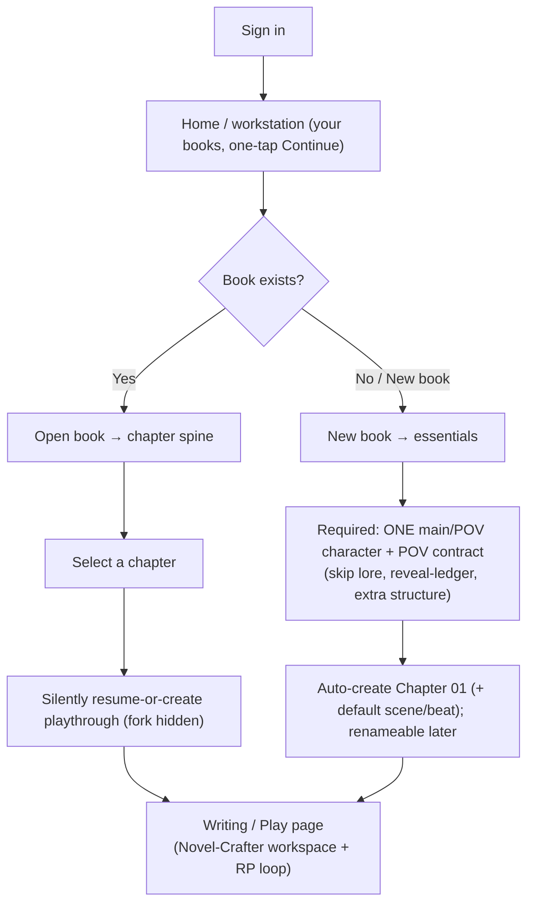

# Phase 1: Walking Skeleton — The narrator → me loop
## Directed Interactive Novel Engine (DINE)

**Timeline:** ~1.25 Months (5–6 Sprints)
**Sprint Duration:** 1 Week
**Depends on:** Phase 0 (running app, both DB realms, `LlmClient` + roles, seeded `prompt_blocks`, story/workspace surfaces).
**Governing ADRs:** 0016 (narrator loop), 0015 (beat document — minimal), 0018 (character creation — minimal manual), 0012 (persistence/session), 0020 (prompt blocks — narrator subset).

> **Goal — the first playable thing.** A human can create one minimal character and one hand-authored beat, **open a chapter** (which starts a playthrough behind the scenes), and **play a solo narrated scene**: the narrator writes prose, hands off to the player, the player writes back, and the narrator continues. This builds the **loop spine** (session fork → state machine → narrator turn → player moment → resume) and the **narrator's final prompt** (`POV_CONTRACT, BEAT, SCENE_STATE, LOREBOOK, RESUME_ANCHOR`). No NPC agents, no recorder two-layer, no psychology yet — those light up in Phases 2 and 5. **After this phase you can feel the loop.**

> **The way in (E0 — the front door, built first).** Before any engine machinery, this phase establishes **how a human reaches play and where play lives**, so the experience is **"open a book, pick a chapter, and I'm writing/playing"** — never "configure a session." Sign in → **Home** (your books, one-tap **Continue**) → open a book → **select a chapter** → land in the **Writing/Play page** (a Novel-Crafter-style workspace that also hosts the RP loop). A **new** book uses the thinnest onboarding — the only required step is **one main/POV character + POV contract**; everything else is skippable; **Chapter 01 is auto-created** and you drop straight into the Writing page. The two-realm save fork (ADR 0012) is **kept but invisible**: selecting a chapter silently resumes-or-creates the playthrough. "Saves" is demoted from the entrance to an optional **branches/history** panel inside the Writing page. **E0 is the host every later play story mounts into.**

> **What is deliberately deferred:** NPC turns + the `NPC_MOMENT` handoff (Phase 2), the two-layer recorder + `true_state`/witnessing + POV projection (Phase 2), sourced player delivery into a record (Phase 2), the nudge / word-budget clock / `MESH_AWARENESS` / `DIRECTOR_STATE` (Phase 4), all relationship/internal psychology (Phase 5). This phase keeps a single canonical prose history, not a two-layer record.

---

## Product Backlog Overview

### Epic Summary

| Epic ID | Epic Name | Priority | Story Points | Sprints |
|---------|-----------|----------|--------------|---------|
| E0 | The Play Front Door (Home → chapter → Writing page) | Critical | 21 | 1–3 |
| E1 | Minimal Authoring for Play | Critical | 13 | 1 |
| E2 | Session & Save (Fork) | Critical | 16 | 2 |
| E3 | Session State Machine (the spine) | Critical | 13 | 3 |
| E4 | Narrator Turn — Prose Call | Critical | 18 | 3–4 |
| E5 | Player Moment, Memory & Prose Display | Critical | 16 | 4–5 |

**Total Estimated:** ~97 Story Points

> **Read E0 first.** E0 is the *front door and host* — the navigation and the Writing/Play page the rest of the phase fills in. Its **shell** stories (E0.1 Home, E0.4 Writing/Play page) are built in Sprint 1 with only Phase-0 preconditions; its **wiring** stories (E0.2 chapter entrance, E0.3 onboarding) schedule after the authoring + fork they depend on (E1/E2), completing the door once the engine behind it exists.

---

## EPIC E0: The Play Front Door — Home → book → chapter → Writing page

> **The missing front door — and the reason the loop kept being built without a place to live.** Every other epic builds *machinery for play*; this one builds the **way in** and the **place play happens**, so the human's first experience is **"open a book, pick a chapter, and I'm writing/playing,"** not "configure a session." It is specified **first** because it is the **host** every later play story mounts into (the prose reader E5.4, the narrator → me loop E3/E4/E5, and later NPC turns in Phase 2) and the **front door** all navigation funnels through. **Play-first:** an *existing* book takes **zero setup** (Home → book → chapter → Writing page, resumed in place); a *new* book uses the **thinnest** onboarding — only a main/POV character + POV contract is required, everything else skippable — then drops you straight into the Writing page on an **auto-created Chapter 01**. The two-realm save fork (ADR 0012) is **kept but invisible**: selecting a chapter silently resumes-or-creates the playthrough. **"Saves" is demoted** from the entrance to an optional branches/history panel inside the Writing page.



### E0.1 — Home / workstation (your books, play-first)

| ID | User Story | Story Points | Priority | Sprint |
|----|------------|--------------|----------|--------|
| S-0.1.1 | As a **player**, I want to land on a Home of my books after signing in — each offering a one-tap **Continue** into exactly where I last played and a clear **New book** action — so that getting into play takes the fewest possible steps | 3 | Critical | 1 |

**Acceptance Criteria - S-0.1.1:**
```gherkin
Feature: Play-first Home

Scenario: Continue straight into play
  Given I own at least one book with an in-progress playthrough
  When I sign in and land on Home
  Then each book offers a one-tap "Continue" that resumes my last position in the Writing page
  And I never pass through a separate "start session" or "saves" screen to continue

Scenario: A new user with no books
  Given I own no books yet
  When I land on Home
  Then I am shown guidance and a single clear "New book" action
  And there is no dead navigation to play surfaces that cannot yet work

Scenario: Start a brand-new book
  Given I am on Home
  When I choose "New book"
  Then I begin the streamlined onboarding (E0.3)
```

> **Technical Notes E0.1:**
> - **Preconditions:** Phase 0 Workspace dashboard (`Dashboard.vue` story list), app shell, and the post-login redirect to `dashboard`.
> - **Integrates-into:** **reshape the existing `/dashboard` (`Dashboard.vue`) into the play-first Home** — story cards gain a **Continue** affordance that resolves the owner's most-recent active playthrough + position. The resolution wires fully once E2.1 (fork) + S-2.1.3 (loop state) exist; until then **Continue** routes to the book's chapter spine (E0.2). No new top-level page; no new sidebar item.
> - **Leak-guards:** `none` (navigation only; Phase-0 owner-scoping still applies — a user only ever sees their own books).

---

### E0.2 — Open a book → pick a chapter → Writing page (the entrance)

| ID | User Story | Story Points | Priority | Sprint |
|----|------------|--------------|----------|--------|
| S-0.2.1 | As a **player**, I want to open a book and see its **chapters** (the chapter spine), then **select a chapter** and land directly in the Writing/Play page positioned at that chapter — with no visible session/fork step | 3 | Critical | 2 |
| S-0.2.2 | As a **system**, I want selecting a chapter to **silently resolve play state** (resume the player's active playthrough, or auto-create one positioned at that chapter on first play) so that the fork stays invisible and entry is one tap | 5 | Critical | 3 |

**Acceptance Criteria - S-0.2.1:**
```gherkin
Feature: Chapter-centric entrance

Scenario: Open a book to its chapter spine
  Given I own a book
  When I open it
  Then I see its chapters in reading order as the primary way in
  And selecting a chapter takes me into the Writing/Play page for that chapter

Scenario: No visible session machinery
  Given I select a chapter
  Then I am not asked to "start a session" or pick a save first
  And I arrive in the Writing page ready to play
```

**Acceptance Criteria - S-0.2.2:**
```gherkin
Feature: Invisible play-state resolution

Scenario: Resume in place
  Given I have an active playthrough of this book
  When I open the chapter I am currently at
  Then my playthrough resumes at its persisted position (it is not restarted)

Scenario: First play of a book
  Given I have no playthrough yet
  When I select a chapter
  Then a playthrough is created behind the scenes, positioned at that chapter's start
  And the fork is never shown to me as a step

Scenario: One default playthrough in the main flow
  Given I have exactly one active playthrough
  When I select a chapter
  Then chapter selection always uses it
  And keeping multiple parallel playthroughs (branches) is an optional action, never required to play
```

> **Technical Notes E0.2:**
> - **Preconditions:** E1.2 (chapters — the spine to list) for S-0.2.1; **S-2.1.1 (fork) + S-2.1.3 (loop state) + E3 (spine)** for S-0.2.2.
> - **Integrates-into:** the per-book view (today the `stories.show` Overview) gains a **chapter spine** entrance; selecting a chapter routes into the Writing/Play page (the reshaped `sessions/Play.vue`, E0.4). S-0.2.2 wraps the existing `SessionService` fork/resume so the `stories.saves.store` + `stories.saves.play` behavior is triggered **implicitly** by chapter selection instead of an explicit "Start session" button. The authoring template is still never mutated (ADR 0012).
> - **Leak-guards:** `none` at the door (the player tier sees rendered prose only once inside; engine isolation lives in Phase 2+).

---

### E0.3 — Streamlined new-book onboarding (POV-gated, then play)

| ID | User Story | Story Points | Priority | Sprint |
|----|------------|--------------|----------|--------|
| S-0.3.1 | As a **player**, I want to create a new book by entering only the essentials plus **one main/POV character with a POV contract** — skipping lore, reveal ledger, and extra structure — and be dropped straight into the Writing page on an **auto-created Chapter 01** (renameable later), so that nothing stands between me and playing | 5 | Critical | 3 |

**Acceptance Criteria - S-0.3.1:**
```gherkin
Feature: Thinnest onboarding to play

Scenario: Minimum required, everything else skippable
  Given I am creating a new book
  When I provide the book essentials and one main/POV character with a POV contract
  Then I can skip lore, reveal-ledger, and any further structure authoring
  And the book is created ready to play

Scenario: Auto Chapter 01, then straight into the Writing page
  Given a new book with no chapter
  When onboarding completes
  Then Chapter 01 is created automatically, with a default scene and beat so the narrator can open
  And I am taken straight into the Writing/Play page for Chapter 01

Scenario: Rename later, not now
  Given Chapter 01 was auto-created
  Then I can rename it at any later time
  And renaming is never required before playing

Scenario: POV is the only hard gate
  Given I omit a main/POV character or its POV contract
  When I try to finish onboarding
  Then it cannot complete and I am told clearly that a POV character + contract is required
  And no other authoring entry (lore, reveal-ledger, extra beats) blocks reaching the Writing page
```

> **Technical Notes E0.3:**
> - **Preconditions:** E1.1 (the minimal POV character + mandatory `knowledge_boundary`), E1.2 (the Chapter-1 anchor behavior + a beat the narrator can open on), S-0.2.2 (silent play-state resolution); story create from Phase 0.
> - **Integrates-into:** extends the existing story-create flow (`stories.store`) into a short onboarding that ends by routing into the Writing page (E0.4). Reuses the **Chapter-1 anchor** already specified in E1.1 (committing the first character ensures a default Chapter 1) so onboarding and manual authoring converge on the same auto-chapter and never double-create. Onboarding additionally **auto-seeds a default scene + a default beat** (POV taken from the POV character/contract; a system-supplied default `goal`) so the relaxed gate below is met with no manual structure authoring.
> - **Business Logic — relaxed front-door readiness:** the gate to reach the Writing page is **a main/POV character + POV contract + ≥ 1 chapter** (auto Chapter 01 satisfies it). Lore, reveal-ledger, and extra beats stay optional. The beat `goal` becomes an **authoring enrichment** (the system supplies a default so E1.2's "a goal is required" invariant holds without burdening the player); goals only become *load-bearing* for directed play in Phase 4. This is a deliberate relaxation of the Overview play-readiness used by the fork (S-1.2.1 / `Session_Fork_Flow`) for the fast path.
> - **Leak-guards:** `knowledge_boundary` is still **mandatory** on the POV/main character even on this fast path — onboarding skips *optional* authoring only, never the leak-critical fields the engine depends on later.

---

### E0.4 — The Writing / Play page shell (Novel-Crafter workspace + RP host)

| ID | User Story | Story Points | Priority | Sprint |
|----|------------|--------------|----------|--------|
| S-0.4.1 | As a **player/author**, I want the Writing/Play page to be the central workspace — a codex rail (characters, lore), the chapter's prose stream in the center, and the play/RP controls within reach — so that one page hosts both reading the chapter and playing the loop, and every later play feature mounts here | 5 | Critical | 1 |

**Acceptance Criteria - S-0.4.1:**
```gherkin
Feature: Writing / Play workspace shell (the host)

Scenario: One workspace for the chapter
  Given I enter a chapter's Writing page
  Then the chapter's prose stream is the center of the workspace
  And a codex rail gives quick access to this book's characters and lore
  And the controls to play/advance and to give my input are within reach

Scenario: The shell is the host; content mounts into it
  Given the Writing page shell exists
  Then the prose reader (S-5.4.1), the narrator → me loop (E3/E4/E5), and later NPC turns (Phase 2) render inside this shell
  And no separate detached play page is created — they extend this host

Scenario: Branches are optional, not the entrance
  Given I am in the Writing page
  Then I can optionally open a branches/history panel to manage parallel playthroughs (the former "Saves")
  And I never need it to start or continue playing

Scenario: Orientation and safe failure
  Given I am in the Writing page
  Then I can see which book and chapter I am in
  And if a generation fails, prior prose stays readable and I can retry without losing my place
```

> **Technical Notes E0.4:**
> - **Preconditions:** Phase 0 app shell + the existing `sessions/Play.vue` page and `stories.saves.play` route (reshaped, not replaced) + the Phase-0 characters/lorebook surfaces the codex rail reads.
> - **Integrates-into:** **reshape `sessions/Play.vue` into the Writing/Play workspace shell** — the codex rail reads the book's existing character + lorebook data; the center hosts the prose stream that S-5.4.1 fills; the play/input controls host E5.1. **Demote the Saves tab** (`stories.saves.index`) from the workspace entrance to an optional branches/history panel surfaced from within the Writing page. The chapter-entry route (E0.2) lands here. This is the single host; the standing anti-orphan rule (program §3) means later play stories **extend** it rather than standing up a new page.
> - **Leak-guards:** player sees rendered prose only (the player tier of the three-agent isolation model). The **codex rail shows authoring-side book data to the human only** — it never feeds an agent prompt, so it sits outside the assembler boundary and introduces no leak.

---

## EPIC E1: Minimal Authoring for Play

> The smallest authoring needed so a scene can run. Reuses the existing per-story workspace (Phase 0) — fills the `characters` and `structure` surfaces that currently render `ComingSoon`.

### E1.1 — Minimal Character (manual card)

| ID | User Story | Story Points | Priority | Sprint |
|----|------------|--------------|----------|--------|
| S-1.1.1 | As an **author**, I want to create a minimal character by hand (name, appearance, identity prose, `is_player`, mandatory `knowledge_boundary`) so that a scene has someone to be about — with no LLM call and no API key | 5 | Critical | 1 |
| S-1.1.2 | As an **author**, I want to mark exactly one character as the player (appearance + `base_opacity` only, no simulated interiority) so that the human supplies that character's behavior | 3 | Critical | 1 |

**Acceptance Criteria - S-1.1.1:**
```gherkin
Feature: Minimal Manual Character

Scenario: Create a character with no model call
  Given I am in a story's character surface
  When I create a character with:
    | Field              | Value                                  |
    | name               | Luna                                   |
    | appearance         | small, sharp-eyed, fidgets with gloves |
    | folded_identity    | a guarded classmate who deflects       |
    | knowledge_boundary | { knows: [...], does_not_know: [...] } |
  Then the character is created scoped to this story
  And no LLM call is made and no API key is required
  And it is stored as a chapter-1 character_card (the existing per-(character,chapter) table)

Scenario: knowledge_boundary is mandatory
  Given I create a character
  When I omit knowledge_boundary
  Then creation is rejected with a clear message
  And knowledge_boundary is required even in this minimal manual mode
```

**Acceptance Criteria - S-1.1.2:**
```gherkin
Feature: Player Character (minimal)

Scenario: Exactly one player per story
  Given a story
  When I set a character is_player = true
  Then that character carries appearance + base_opacity only
  And it has no simulated interiority and no outgoing edges
  And a second is_player on the same story is rejected with a clear message
```

> **Technical Notes E1.1:**
> - **Preconditions:** Phase 0 `characters` + `character_cards` **+ `chapters`** tables and the per-story workspace nav. A character's minimal fields (`appearance`, `folded_identity`, `knowledge_boundary`) live only on the per-`(character, chapter)` `character_card`, whose `chapter_id` is `NOT NULL` — so a character **cannot** exist without a chapter. Characters are parts of the novel and tied to its chapters (Novel-Crafter model); the chapter is the backbone.
> - **Chapter-1 anchor:** to keep E1.1 functional standalone, the `characters` surface **ensures a default `Chapter 1`** (number `1`, title `"Chapter 1"`, `pov_default` = the story's resolved default POV) when the first character is committed, and commits the character's `chapter-1` `character_card` under it. E1.2 (Structure) later refines that same chapter — it is not re-created.
> - **Integrates-into:** the existing per-story workspace `characters` surface (replace its `ComingSoon` placeholder with a list + minimal create/edit form); reuse `StoryService` patterns for owner-scoping and slug derivation, and the close sibling `LorebookController`/`RevealLedgerController` CRUD shape.
> - **Leak-guards:** `knowledge_boundary` is captured now because Phase 2's NPC `IDENTITY`/`SCENE_EXCERPT` blocks and Phase 4's `NUDGE` leak-check depend on it. No guard runs at authoring time.
> - This is the **minimal manual slice** of ADR 0018 — the full AI/hybrid creation pipeline + bible→card compile lands in Phase 5. Edges/registers/sensitivities (`live_axes` content) are **not** authored here.

---

### E1.2 — Minimal Structure (one beat by hand)

| ID | User Story | Story Points | Priority | Sprint |
|----|------------|--------------|----------|--------|
| S-1.2.1 | As an **author**, I want to author a single chapter → scene → beat by hand (scene: `pov_mode`, `pov_anchor`, `tone`, present characters; beat: `goal`) so that the loop has a position and an anchor to narrate toward | 5 | Critical | 1 |

**Acceptance Criteria - S-1.2.1:**
```gherkin
Feature: Minimal Manual Structure

Scenario: Author one chapter / scene / beat
  Given a story with at least one character
  When I create a chapter, a scene, and a beat by hand:
    | Level | Field              | Value                          |
    | scene | pov_mode           | third_limited                  |
    | scene | pov_anchor         | Luna                           |
    | scene | tone               | tense                          |
    | scene | present_characters | [Luna, the player]             |
    | beat  | goal               | "Luna and the player meet"     |
  Then the rows are committed scoped to this story
  And the beat carries a goal as its satisfaction anchor

Scenario: A goal is required
  Given I author a beat with no goal
  When I save
  Then it is rejected — the goal is the only load-bearing beat field this phase

Scenario: Story becomes play-ready
  Given a story with >= 1 character (incl. the player) and >= 1 chapter/scene/beat and a resolvable narrator model
  When I view its play-readiness
  Then it is reported playable
```

> **Technical Notes E1.2:**
> - **Preconditions:** Phase 0 `chapters/scenes/beats` tables + the workspace `structure` surface + the existing play-readiness gate in `StoryOverviewService`.
> - **Integrates-into:** the per-story workspace `structure` surface (replace `ComingSoon`). The full beat document (`intent`, `word_budget`, `nudge_target`) and outline compilation arrive in Phase 4 — this phase authors only `goal` + scene POV/tone/present-characters.
> - **Leak-guards:** none at authoring time. `pov_mode`/`pov_anchor`/`tone` feed the narrator `POV_CONTRACT` block (E4).

---

## EPIC E2: Session & Save (Fork)

### E2.1 — Start, Multi-Save, Loop State

| ID | User Story | Story Points | Priority | Sprint |
|----|------------|--------------|----------|--------|
| S-2.1.1 | As a **player**, I want starting a playthrough to deep-copy the play-ready story into a save realm (the fork mechanics behind the invisible chapter-entry of E0.2.2) so that a playthrough evolves without touching the template | 8 | Critical | 2 |
| S-2.1.2 | As a **player**, I want multiple independent saves (name, list, load, reset, delete) so that I can keep parallel playthroughs | 5 | High | 2 |
| S-2.1.3 | As a **system**, I want to persist loop state (state_node, current chapter/scene/beat, resume_anchor, last-played) so that a session resumes exactly where it left off | 3 | Critical | 2 |

**Acceptance Criteria - S-2.1.1:**
```gherkin
Feature: Start a Session (Fork)

Scenario: Forking deep-copies the template into a save realm
  Given a play-ready story
  When I start a new session
  Then a save realm scoped to that session is created
  And the authored starting state is deep-copied into it
  And the session begins at session_start, positioned at the first chapter/scene/beat
  And the authoring template is never mutated by play

Scenario: The fork is atomic
  Given a fork in progress
  When it fails partway
  Then no half-seeded session is created or loadable

Scenario: No edges are seeded yet
  Given the minimal characters carry no edges this phase
  When the session is forked
  Then no relationship edges are created (disposition-prior seeding arrives in Phase 5)
```

**Acceptance Criteria - S-2.1.2:**
```gherkin
Feature: Multiple Independent Saves

Scenario: Parallel saves
  Given a story I own
  When I create and name more than one save
  Then each is an independent fork; changes in one never affect another

Scenario: List, load, reset, delete
  Given several saves
  Then I can list them with name + last-played, load one to resume, reset one to the freshly-forked state, and delete one (with confirmation) without touching others or the template
```

**Acceptance Criteria - S-2.1.3:**
```gherkin
Feature: Loop State Persistence

Scenario: Resume restores the exact position
  Given an in-progress session that persists { state_node, current chapter/scene/beat, resume_anchor, last-played }
  When I load it later
  Then the engine restores the same state_node and position
  And narration continues from the persisted resume_anchor rather than restarting the beat

Scenario: Consistent under interruption
  Given a session interrupted mid-turn
  When I reload it
  Then loop state reflects the last committed boundary, never a half-applied turn
```

> **Technical Notes E2.1:**
> - **Preconditions:** Phase 0 `play_sessions` table (migrated, behaviorless) + owner-scoping concerns.
> - **Integrates-into:** a new `SessionService` holding the fork/resume mechanics. **This epic builds the fork *mechanics*, not the entrance** — the player-facing trigger is **chapter selection (E0.2.2)**, which calls these same `SessionService` operations invisibly. The `saves` surface is **not** the way in; it is repurposed by E0.4 into the optional **branches/history panel** inside the Writing/Play page. Loop state lives on `play_sessions` (`state_node`, position, `resume_anchor`, `last_played_at`). Word-counters/nudge-level/narrative-clock columns exist but stay unused until Phase 4.
> - **Leak-guards:** none (no agent runs in a fork). Multi-save/reset/delete come free from the fork model (ADR 0012).

---

## EPIC E3: Session State Machine (the spine)

### E3.1 — The Spine & Minimal Handoff

| ID | User Story | Story Points | Priority | Sprint |
|----|------------|--------------|----------|--------|
| S-3.1.1 | As a **system**, I want the state machine to drive `session_start → narrator_turn → {player_moment \| beat_complete} → narrator_resumes` so that the loop has a deterministic spine | 8 | Critical | 3 |
| S-3.1.2 | As a **system**, I want the state machine itself to be the only conductor (no separate orchestrator module) so that the loop stays simple and extensible | 5 | Critical | 3 |

**Acceptance Criteria - S-3.1.1:**
```gherkin
Feature: The Session Spine (skeleton subset)

Scenario: Deterministic transitions
  Given an active session
  Then the state machine moves through session_start → narrator_turn → { player_moment | beat_complete } → narrator_resumes
  And the next node is determined by the narrator turn's structured handoff signal

Scenario: Only player_moment and beat_complete this phase
  Given a completed narrator turn
  When the handoff is player_moment
  Then control passes to the player and the loop awaits input
  When the handoff is beat_complete
  Then the beat is closed and the narrator resumes at the next beat
  And npc_moment is not yet a reachable branch (it lights up in Phase 2)
```

**Acceptance Criteria - S-3.1.2:**
```gherkin
Feature: The State Machine is the Conductor

Scenario: No separate orchestrator
  Given the running loop
  Then the state machine itself sequences every step
  And there is no separate orchestrator module deciding transitions
```

> **Technical Notes E3.1:**
> - **Preconditions:** S-2.1.1 (a forked session), S-2.1.3 (loop state).
> - **Integrates-into:** a `SessionStateMachine` service advanced from the Writing/Play page host (E0.4; its prose reader is filled by E5.4). It owns the spine; the `npc_moment` branch is added (not rebuilt) in Phase 2, and boundary events (`SCENE_DONE`/`CHAPTER_DONE` batched subsystems) are added in Phase 4.
> - **Leak-guards:** none directly; it is the conductor that later sequences recorder-first ordering (Phase 2) and boundary subsystems (Phase 4). ADR 0016 §1/§4.

---

## EPIC E4: Narrator Turn — Prose Call

### E4.1 — Narrator Prompt Assembly (narrator blocks lit this phase)

| ID | User Story | Story Points | Priority | Sprint |
|----|------------|--------------|----------|--------|
| S-4.1.1 | As a **system**, I want to assemble the narrator prompt from the seeded `prompt_blocks` registry for the blocks lit this phase (`POV_CONTRACT, BEAT, SCENE_STATE, LOREBOOK, RESUME_ANCHOR`) so that the narrator has exactly its registry-defined slots and nothing more | 8 | Critical | 3 |

**Acceptance Criteria - S-4.1.1:**
```gherkin
Feature: Narrator Prompt Assembly (registry-driven, this-phase subset)

Scenario: The prompt carries only the registry blocks whose producers exist
  Given a narrator turn is about to run
  When the prompt is assembled from prompt_blocks for agent "narrator"
  Then it contains, ordered by order_index within section:
    | Block         | Content                                                   |
    | POV_CONTRACT  | scene pov_mode + pov_anchor + tone                        |
    | BEAT          | current beat goal (intent/word_budget arrive in Phase 4)  |
    | SCENE_STATE   | present characters + immediate context + scene log        |
    | LOREBOOK      | keyword-matched world facts (existing lorebook)           |
    | RESUME_ANCHOR | injected only when resuming                               |
  And blocks whose producers are not yet built (MESH_AWARENESS, DIRECTOR_STATE) are absent — no filler is injected

Scenario: Assembly reads the registry, not hard-coded order
  Given the prompt_blocks rows seeded in Phase 0
  When the assembler builds the narrator prompt
  Then block selection and order come from order_index/section/is_active rows, not code constants
```

> **Technical Notes E4.1:**
> - **Preconditions:** Phase 0 seeded `prompt_blocks`, `LlmClient` + `narrator_prose` role, lorebook keyword matcher; E1.2 scene/beat; E3 spine.
> - **Integrates-into:** a `NarratorPromptAssembler` that reads `prompt_blocks` (this is the narrator half of the ADR 0007/0020 assembler; the NPC half is built in Phase 2 and they share the registry-driven selection logic).
> - **Leak-guards:** `POV_CONTRACT`/`SCENE_STATE`/`LOREBOOK`/`RESUME_ANCHOR` = `none`; `BEAT` = `omniscient_authoring` (author-side; minimal goal-only this phase). The `MESH_AWARENESS` hedged-attribution directive arrives with the relationship mesh in Phase 4.

---

### E4.2 — Structured Prose Output

| ID | User Story | Story Points | Priority | Sprint |
|----|------------|--------------|----------|--------|
| S-4.2.1 | As a **system**, I want the prose call to return structured output (prose · handoff signal · inferred elapsed bucket) so that handoff detection is the prose call's own output, not a separate classifier pass | 5 | Critical | 4 |
| S-4.2.2 | As a **system**, I want malformed structured output retried within a bound then surfaced as failed so that the loop never trusts an unparseable result | 5 | Critical | 4 |

**Acceptance Criteria - S-4.2.1:**
```gherkin
Feature: Structured Prose Output

Scenario: One call returns prose + handoff + elapsed bucket
  Given the prose call runs on the narrator_prose model
  When it completes
  Then it returns structured output:
    | Field          | Value                                          |
    | prose          | the narrated text                              |
    | handoff        | player_moment | beat_complete                  |
    | elapsed_bucket | inferred in-world gap (continuous ... longer)  |
  And handoff is this structured output, not a separate classifier pass
  And the handoff vocabulary is limited to player_moment | beat_complete this phase
```

**Acceptance Criteria - S-4.2.2:**
```gherkin
Feature: Never Trust Malformed Output

Scenario: Retry then surface
  Given the prose call returns an unparseable/non-conforming structure
  Then it is retried with bounded backoff
  And, failing that, it is recorded as a failed call and surfaced to the player — never guessed
```

> **Technical Notes E4.2:**
> - **Preconditions:** S-4.1.1; Phase 0 structured-output validation/retry in `LlmClient`.
> - **Integrates-into:** `LlmClient.completeStructured`; the structured result drives the E3 state machine's next node.
> - **Leak-guards:** none new. `npc_moment` is added to the handoff enum in Phase 2; the `elapsed_bucket` is captured now but only consumed by decay in Phase 5 (recorded harmlessly until then).

---

## EPIC E5: Player Moment, Memory & Prose Display

### E5.1 — Player Input

| ID | User Story | Story Points | Priority | Sprint |
|----|------------|--------------|----------|--------|
| S-5.1.1 | As a **player**, I want to write prose input at a player moment so that I act in the scene and the narrator continues from what I wrote | 3 | Critical | 4 |

**Acceptance Criteria - S-5.1.1:**
```gherkin
Feature: Player Moment Input (skeleton)

Scenario: Submit prose and continue
  Given the handoff is player_moment
  When I write my action/dialogue as prose and submit
  Then my input enters the immediate context as the player's contribution
  And the narrator resumes, continuing from it

Scenario: Input is the player's own behavior
  Given is_player is not simulated
  Then the human supplies the behavior; the engine does not generate the player's action
```

> **Technical Notes E5.1:**
> - **Preconditions:** E3 spine, E4 prose call.
> - **Integrates-into:** the Writing/Play page host (E0.4) — the player input control lives here (its prose reader is filled by E5.4). This phase stores player input as plain text in the immediate context / scene log. **Sourced delivery (prose → tone tag → infer/ask) and recording into the two-layer record arrive in Phase 2**, where an NPC must witness the player's surface.
> - **Leak-guards:** none this phase (no NPC consumes the player's surface yet).

---

### E5.2 — Immediate Context & Scene Log

| ID | User Story | Story Points | Priority | Sprint |
|----|------------|--------------|----------|--------|
| S-5.2.1 | As a **system**, I want an immediate-context window (~2000 tokens) and a canonical scene log, compacted into a scene summary at SCENE_DONE, so that context stays bounded while continuity is preserved | 5 | High | 5 |

**Acceptance Criteria - S-5.2.1:**
```gherkin
Feature: Memory Layers (skeleton)

Scenario: Bounded immediate context
  Given an ongoing scene
  Then an immediate-context window of about 2000 tokens carries the recent exchange

Scenario: Scene summary at SCENE_DONE
  Given the immediate context has grown across a scene
  When SCENE_DONE fires
  Then it is compacted into a scene summary and the window is bounded again

Scenario: Canonical history only
  Given prose committed to the scene log
  Then the playthrough history shows the canonical prose in order
  (the two-layer surface/true_state record arrives in Phase 2)
```

> **Technical Notes E5.2:**
> - **Preconditions:** E2 session, E4 prose.
> - **Integrates-into:** `scene_summaries` (Phase 0 table) + immediate-context held on the session. `chapter_logs` compaction and decay-at-boundary arrive in Phases 4–5.
> - **Leak-guards:** none. Lorebook injection here is world-facts-only (narrator); knowledge-boundary-clamped NPC injection arrives in Phase 2.

---

### E5.3 — Resume Anchor

| ID | User Story | Story Points | Priority | Sprint |
|----|------------|--------------|----------|--------|
| S-5.3.1 | As a **system**, I want to build and inject the resume anchor (scene type, last line, POV, tone) on resume after any pause so that the narrator continues seamlessly rather than restarting the beat | 3 | High | 5 |

**Acceptance Criteria - S-5.3.1:**
```gherkin
Feature: Resume Anchor

Scenario: Build on pause, inject on resume
  Given the session pauses (player moment, or save/load)
  Then a resume anchor is built from scene type, last line, POV, and tone
  When the narrator resumes
  Then the resume anchor is injected into the narrator prompt (RESUME_ANCHOR block)
  And narration continues seamlessly rather than restarting the beat
```

> **Technical Notes E5.3:**
> - **Preconditions:** S-2.1.3 (`resume_anchor` on the session), S-4.1.1 (`RESUME_ANCHOR` block).
> - **Integrates-into:** the narrator assembler; the anchor is the continuity seam consumed on `narrator_resumes`.
> - **Leak-guards:** `none`. ADR 0016 §5.

---

### E5.4 — Play Surface (Prose Display) — fills the E0.4 Writing-page host

| ID | User Story | Story Points | Priority | Sprint |
|----|------------|--------------|----------|--------|
| S-5.4.1 | As a **player**, I want the Writing/Play page to render prose in the scene's POV contract with a readable scrollback and advance/pause-save controls so that I can actually play the loop and stay oriented | 5 | Critical | 5 |

**Acceptance Criteria - S-5.4.1:**
```gherkin
Feature: Play Surface

Scenario: Enter play by selecting a chapter
  Given a play-ready book
  When I open it and select a chapter (E0.2 — the playthrough resolves silently)
  Then prose renders in the scene's POV contract with comfortable typography inside the Writing-page host
  And I can read a scrollback of committed prose in order

Scenario: Advance, pause/save, orientation
  Given I am in an active session
  Then I can advance the loop, pause/save to persist state, and see the current chapter/scene/beat
  And resuming continues from where I left off

Scenario: Generation failure is recoverable
  Given a prose call fails
  Then I am told it was interrupted, prior prose stays readable, and I can retry without losing the session
```

> **Technical Notes E5.4:**
> - **Preconditions:** **S-0.4.1 (the Writing/Play page host)**, E2 saves, E3 spine, E4 prose, E5.1 input.
> - **Integrates-into:** **the Writing/Play page shell from E0.4** (the reshaped `sessions/Play.vue`) — this story fills the host's center prose region; it does **not** stand up a new page. Reached by selecting a chapter (E0.2), not via a Saves "Start" button; reuse the app shell + loading/empty/error states from Phase 0.
> - **Leak-guards:** player sees rendered prose only (the player tier of the three-agent isolation model). Progressive streaming is minimal here (single narrator call); full multi-call streaming arrives in Phase 3.

---

## Sprint Roadmap

### Sprint 1: Front Door Shell + Minimal Authoring (E0 shell + E1)
```
├── S-0.1.1: Play-first Home (your books, one-tap Continue, New book)
├── S-0.4.1: Writing/Play page shell — the host content mounts into (reshape sessions/Play.vue)
├── S-1.1.1: Minimal manual character (+ mandatory knowledge_boundary)
├── S-1.1.2: Player character (appearance + base_opacity, no interiority)
├── S-1.2.1: One chapter/scene/beat by hand (goal + POV/tone/present-characters)
└── Test: story reports play-ready; the Writing-page host renders (empty) and is reachable
```

### Sprint 2: Session Fork & Chapter Entrance (E2 + E0.2 entrance)
```
├── S-2.1.1: Start a session (atomic deep-copy fork; template never mutated)
├── S-2.1.2: Multi-save (name/list/load/reset/delete) — now the optional branches panel
├── S-2.1.3: Loop state persistence (state_node, position, resume_anchor)
├── S-0.2.1: Open book → chapter spine → select chapter → Writing page
└── Test: fork atomic; resume restores exact position; chapter selection reaches the Writing page
```

### Sprint 3: Spine, Narrator Assembly & Invisible Entry (E3 + E4.1 + E0.2/E0.3)
```
├── S-3.1.1: State machine spine (player_moment | beat_complete)
├── S-3.1.2: State machine is the only conductor
├── S-4.1.1: Narrator prompt assembly (POV_CONTRACT/BEAT/SCENE_STATE/LOREBOOK/RESUME_ANCHOR)
├── S-0.2.2: Silent play-state resolution on chapter open (fork hidden; resume-or-create)
├── S-0.3.1: Streamlined POV-gated onboarding → auto Chapter 01 → Writing page
└── Test: deferred blocks absent (no filler); chapter open never shows a fork/session step
```

### Sprint 4: Prose Call & Player Input (E4.2 + E5.1)
```
├── S-4.2.1: Structured prose output (prose · handoff · elapsed bucket)
├── S-4.2.2: Malformed output retried then surfaced
├── S-5.1.1: Player moment input
└── Test: handoff is the prose output; malformed never trusted
```

### Sprint 5: Memory, Resume & Play Surface (E5)
```
├── S-5.2.1: Immediate context + scene summary at SCENE_DONE
├── S-5.3.1: Build + inject resume anchor
├── S-5.4.1: Play surface (POV prose, scrollback, advance/pause-save)
└── Phase 1 end-to-end: open a chapter (playthrough starts silently), play narrator -> me -> narrator
```

---

## Definition of Done (DoD)

See the [program DoD](./README.md#9-global-definition-of-done-dod). Phase-1 emphasis:

- [ ] **The front door works play-first:** sign in → Home → open a book → select a chapter → land in the Writing/Play page, with **no visible session/fork step**; an existing book's **Continue** resumes in place; a new book reaches the Writing page through POV-gated onboarding on an auto-created Chapter 01.
- [ ] A human can create one character + one beat, open a chapter (the playthrough starts silently), and **play a solo narrated loop** (narrator → player → narrator) end to end.
- [ ] **Session fork is atomic** and never mutates the authoring template; multi-save/reset/delete are owner-scoped and independent.
- [ ] **Save/resume restores the exact loop position** and continues from the resume anchor rather than restarting the beat.
- [ ] **Handoff is the prose call's structured output** (player_moment | beat_complete); malformed structured output is retried then surfaced — never trusted.
- [ ] Narrator prompt assembly is **registry-driven** from the seeded `prompt_blocks`; blocks with no producer yet are **absent** (no filler).
- [ ] Player sees **rendered prose only**; UX states (loading/empty/error/unauthorized) covered; responsive + keyboard-accessible; `pnpm lint` clean; Wayfinder types regenerate.

---

## Success Metrics — Phase 1

| Metric | Target | Measurement |
|--------|--------|-------------|
| Taps to play (existing book) | ≤ 3 from Home | Home → book → chapter → Writing page, no session/fork screen |
| Taps to play (new book) | POV character is the only required field | New book → POV character + contract → auto Chapter 01 → Writing page |
| First playable loop | Achieved | A human plays narrator → me → narrator end to end |
| Fork integrity | 100% | Template never mutated; fork atomic; resume restores exact position |
| Handoff determinism | 100% | Every turn routed by the prose call's structured handoff |
| Structured-output safety | 0 trusted malformed payloads | Retry-then-surface verified |
| Registry-driven assembly | 100% | Narrator blocks selected/ordered from prompt_blocks rows |

---

## Risk Register — Phase 1

| Risk | Impact | Probability | Mitigation |
|------|--------|-------------|------------|
| The loop doesn't feel good | High | Medium | This phase exists to surface that early; iterate on the narrator prompt before deepening |
| Fork mutates the template | Critical | Low | Atomic transactional deep-copy; template-immutability test |
| Resume restarts the beat / loses tone | Medium | Medium | Resume anchor (scene type · last line · POV · tone) + exact loop-state restore |
| Building a detached play page | Medium | Low | The Writing/Play page host (E0.4) is built first as the single mount point; the prose reader (S-5.4.1) and the loop fill it rather than standing up a new page; entry is chapter-centric (E0.2), not a Saves "Start" button |
| Over-building beyond the skeleton (recorder/psychology creep) | Medium | Medium | Strict deferral list at the top of this doc; only narrator blocks light up this phase |

---

*Document Version: 2.0 · Author: Zulfikar Hidayatullah · Created: June 2026*
